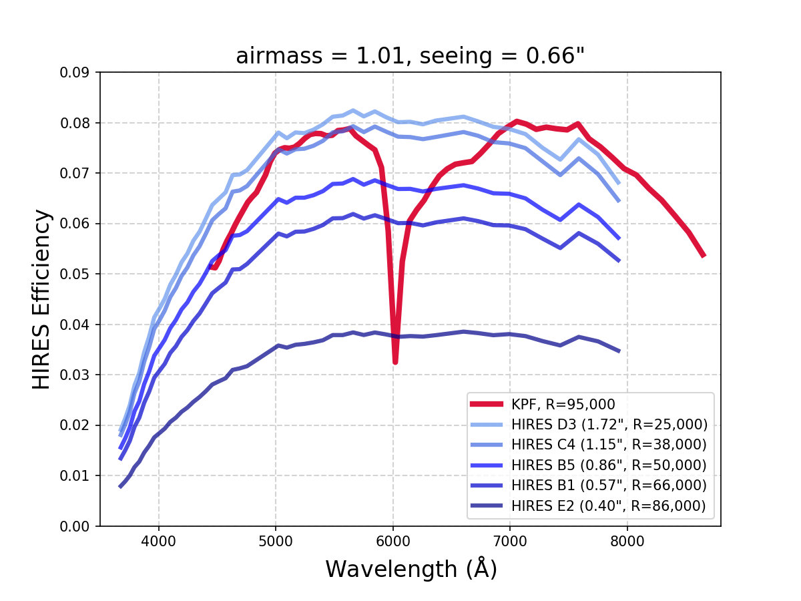

# Comparing KPF to HIRES

This page attempts to compare KPF and HIRES for users who may be wondering which instrument they should propose for.

Fundamentally HIRES is a more flexible instrument with selectable grating angles to control the wavelength coverage and selectable slits which allow the user to trade off throughput against spectral resolution while KPF is a fixed format spectrograph with a fixed input fiber.

HIRES also has a wider spectral coverage than KPF and even includes the option to change the internal optics to optimize either blue or red sensitivity. Though KPF has the Calcium H&K spectrograph, a dedicated arm to examine the 382-402 nm wavelength range around the Ca H&K lines.

KPF, on the other hand, has higher spectral resolution even though it has a larger entrance aperture on sky and so it may be more sensitive for use cases which need that combination.  Of course, KPF is also highly stabilized and is optimized for precision radial velocity measurements.

## Summary Table

| Comparison | KPF | HIRES |
| ---------- | --- | ----- |
| Optical Input | 1.14 arcsec octagonal fibers for science and sky (fixed format) | Selectable deckers and slits for different sky projections (e.g., B5 = 0.87 x 3.5 arcsec) |
| Wavelength Coverage | Fixed format: 445-870 nm (high-res) 382-402 nm (med-res) | ~300-1000 nm in an adjustable format (moving the spectral format across detector) |
| Resolving Power | R=98k (445-870 nm) | depends on slit e.g. R=49k for 0.86 arcsec-wide slit R=80k for 0.40 arcsec-wide slit |
| Throughput (sky to CCD) | ~8-10% peak-of-blaze (measured) | 5-6% peak-of-blaze for B5-B1 deckers (measured) |
| Doppler Precision | 0.5 m/s noise floor (req.) 0.3 m/s (goal) | ~2 m/s systematic noise floor |
| Doppler Speed | ~8-10x faster than HIRES | Limited by need for high SNR to model iodine spectrum |

## Instrument Efficiency Comparison

Prior to delivery of KPF, the KPF Team made a series of HIRES observations of a spectrophotometric standard using deckers that spanned the full range of slit widths (but not all slit lengths, which only affects spatial information).  In the plot below, each blue line plots the peak-of-blaze efficiency from the top of the atmosphere to detected photoelectrons.  The red line is the predicted KPF efficiency curve based on Steve Gibson’s detailed optical model, efficiency curves for each optic (measured, if available), and a model of seeing and the atmosphere that match the airmass and seeing values for the actual HIRES observations.  We saw later that the KPF model is pretty good — it’s ~10% low for wavelengths > 500 nm and is too high for bluer wavelengths (>>10% off for the bluest wavelength).

> Comparison of the measured efficiency for HIRES to the KPF modeled efficiency (later validated, but see discussion above).

The huge range of HIRES efficiency depending on decker is the biggest factor.  For science at lower resolution, KPF and HIRES have comparable efficiency. For high-resolution, KPF is much more efficient.

## Common Observations

WMKO obtained observations designed to compare KPF and HIRES directly on a variety of science targets during 2025A.  This comparison reflects the status of the instruments as they were on 2025 May 15.  Unfortunately, at the time, KPF was impacted by excess pattern noise which raised the apparent read noise from the nominal ~5 electrons to ~13 electrons.  This will affect all of the KPF data below. Please see the [KPF status](status.md) page for the current state of KPF.

Here is a list of what was observed:

| Target           | Mag     | KPF      | HIRES (Ech, XD, Slit, Bin)            | Requestor   |
| -----------      | ------- | -------- | ------------------------------------- | ----------- |
| 29/P-comet       | V~16    | 4x300 s  | 4x300 s (0.1, -0.06, 1.148", 2x2)     | McKay       |
| TW Hydra         | V=10.5  | 2x300 s  | 2x300 s (0.0, 0.90, 1.148", 2x2)      | Hillenbrand |
| HD 96735         | R=8.8   | 2x120 s  | 2x120 s (0.0, -0.10, 0.861", 3x1)     | Zhang       |
| HIP 54597        | R=9.8   | 2x240 s  | 2x240 s (0.0, -0.10, 0.861", 3x1)     | Zhang       |
| J1622+5521       | R=16.2  | 2x1800 s | 2x1800 s (0.1, 0.763, 1.148", 2x2)    | Redfield    |
| HD 187982        | V=5.3   | 1x20 s   | 1x15 s (0.0, 0.2423, 0.4", 1x1)       | Cooke       |
| HD 199478        | V=5.2   | 1x20 s   | 1x15 s (0.0, 0.2423, 0.4", 1x1)       | Cooke       |
| BD+35 1801       | R=8.0   | 3x60 s   | 3x60 s (0.1, -0.06, 0.4", 1x1)        | Nisak       |
| J142543.3+540619 | R=17.8  | 3x600 s  | 3x600 s (0.102, 0.7625, 1.148", 2x2)  | O’Meara     |
| BL Lac           | R=17.2  | 4x600 s  | 1x2400 s (0.102, 0.7625, 1.148", 2x2) | O’Meara     |
| HR 7596          | R=5.6   | 1x20 s   | 1x15 s (0.0, 0.2423, 1.148", 1x1)     | Staff       |
| HR 7596          | R=5.6   | 1x20 s   | 1x15 s (0.0, 0.2423, 0.861", 1x1)     | Staff       |
| HR 7596          | R=5.6   | 1x20 s   | 1x15 s (0.0, 0.2423, 0.574", 1x1)     | Staff       |

### HIRES Raw Data

* All HIRES Science Files: [HIRES_sci_27859_1.tar](https://www2.keck.hawaii.edu/inst/KPF_HIRES_comparison/HIRES_raw/HIRES_sci_27859_1.tar)
* All HIRES Calibration Files: [HIRES_cal_27859_1.tar](https://www2.keck.hawaii.edu/inst/KPF_HIRES_comparison/HIRES_raw/HIRES_cal_27859_1.tar)

### HIRES Reduced Data

A subset of the HIRES observations were reduced automatically at KOA for the following targets:

* BD+35 1801
* TW Hya
* J142543.3+540619
* J1622+5521 targets

These files are available here: [HIRES_sci_51156_1.tar](https://www2.keck.hawaii.edu/inst/KPF_HIRES_comparison/HIRES_KOA_reduced/HIRES_sci_51156_1.tar)

### KPF Reduced Data

The reduced data for KPF is available in the table below.  The "Level 1" file is the extracted 1D spectrum. For details on working with KPF L1 files, see the [KPF DRP page on L1 data format](https://kpf-pipeline.readthedocs.io/en/latest/tutorials/KPF_Data_Tutorial_L1.html).

| Target           | KPF L1 Files |
| -----------      | ------------ |
| 29/P-comet       | [KP.20250516.22710.24](https://www2.keck.hawaii.edu/inst/KPF_HIRES_comparison/KPF_L1/KP.20250516.22710.24_L1.fits) |
|                  | [KP.20250516.22765.38](https://www2.keck.hawaii.edu/inst/KPF_HIRES_comparison/KPF_L1/KP.20250516.22765.38_L1.fits) |
|                  | [KP.20250516.23176.73](https://www2.keck.hawaii.edu/inst/KPF_HIRES_comparison/KPF_L1/KP.20250516.23176.73_L1.fits) |
|                  | [KP.20250516.23597.65](https://www2.keck.hawaii.edu/inst/KPF_HIRES_comparison/KPF_L1/KP.20250516.23597.65_L1.fits) |
|                  | [KP.20250516.23946.39](https://www2.keck.hawaii.edu/inst/KPF_HIRES_comparison/KPF_L1/KP.20250516.23946.39_L1.fits) |
| TW Hydra         | [KP.20250516.28039.30](https://www2.keck.hawaii.edu/inst/KPF_HIRES_comparison/KPF_L1/KP.20250516.28039.30_L1.fits) |
|                  | [KP.20250516.28387.71](https://www2.keck.hawaii.edu/inst/KPF_HIRES_comparison/KPF_L1/KP.20250516.28387.71_L1.fits) |
| HD 96735         | [KP.20250516.29269.54](https://www2.keck.hawaii.edu/inst/KPF_HIRES_comparison/KPF_L1/KP.20250516.29269.54_L1.fits) |
|                  | [KP.20250516.29438.05](https://www2.keck.hawaii.edu/inst/KPF_HIRES_comparison/KPF_L1/KP.20250516.29438.05_L1.fits) |
| HIP 54597        | [KP.20250516.31424.80](https://www2.keck.hawaii.edu/inst/KPF_HIRES_comparison/KPF_L1/KP.20250516.31424.80_L1.fits) |
|                  | [KP.20250516.31713.37](https://www2.keck.hawaii.edu/inst/KPF_HIRES_comparison/KPF_L1/KP.20250516.31713.37_L1.fits) |
| J1622+5521       | [KP.20250516.41859.48](https://www2.keck.hawaii.edu/inst/KPF_HIRES_comparison/KPF_L1/KP.20250516.41859.48_L1.fits) |
|                  | [KP.20250516.43707.83](https://www2.keck.hawaii.edu/inst/KPF_HIRES_comparison/KPF_L1/KP.20250516.43707.83_L1.fits) |
| HD 187982        | [KP.20250516.52220.22](https://www2.keck.hawaii.edu/inst/KPF_HIRES_comparison/KPF_L1/KP.20250516.52220.22_L1.fits) |
| HD 199478        | [KP.20250516.52378.17](https://www2.keck.hawaii.edu/inst/KPF_HIRES_comparison/KPF_L1/KP.20250516.52378.17_L1.fits) |
| BD+35 1801       | [KP.20250516.20851.88](https://www2.keck.hawaii.edu/inst/KPF_HIRES_comparison/KPF_L1/KP.20250516.20851.88_L1.fits) |
|                  | [KP.20250516.21018.50](https://www2.keck.hawaii.edu/inst/KPF_HIRES_comparison/KPF_L1/KP.20250516.21018.50_L1.fits) |
|                  | [KP.20250516.21139.89](https://www2.keck.hawaii.edu/inst/KPF_HIRES_comparison/KPF_L1/KP.20250516.21139.89_L1.fits) |
| J142543.3+540619 | [KP.20250516.32813.20](https://www2.keck.hawaii.edu/inst/KPF_HIRES_comparison/KPF_L1/KP.20250516.32813.20_L1.fits) |
|                  | [KP.20250516.33461.60](https://www2.keck.hawaii.edu/inst/KPF_HIRES_comparison/KPF_L1/KP.20250516.33461.60_L1.fits) |
|                  | [KP.20250516.34123.45](https://www2.keck.hawaii.edu/inst/KPF_HIRES_comparison/KPF_L1/KP.20250516.34123.45_L1.fits) |
| BL Lac           | [KP.20250516.46263.92](https://www2.keck.hawaii.edu/inst/KPF_HIRES_comparison/KPF_L1/KP.20250516.46263.92_L1.fits) |
|                  | [KP.20250516.46912.59](https://www2.keck.hawaii.edu/inst/KPF_HIRES_comparison/KPF_L1/KP.20250516.46912.59_L1.fits) |
|                  | [KP.20250516.47561.22](https://www2.keck.hawaii.edu/inst/KPF_HIRES_comparison/KPF_L1/KP.20250516.47561.22_L1.fits) |
|                  | [KP.20250516.48209.59](https://www2.keck.hawaii.edu/inst/KPF_HIRES_comparison/KPF_L1/KP.20250516.48209.59_L1.fits) |
| HR 7596          | [KP.20250516.53456.67](https://www2.keck.hawaii.edu/inst/KPF_HIRES_comparison/KPF_L1/KP.20250516.53456.67_L1.fits) |
