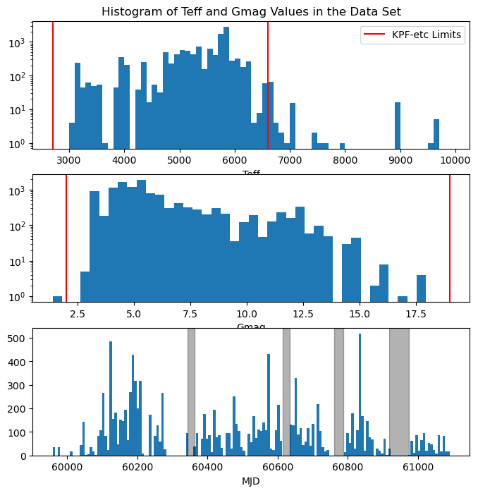

# Examine Properties of Data Set

This data set includes (anonymized) results of the first few years of KPF observations.  This contains select FITS header keyworsds from the DRP's L1 output file.  We're primarily interested in the DRP's estimate of the signal to noise at various wavelengths (the `SNRSCnnn` values).  These are the typical signal to noise for one order around the specified wavelength value in nm.

In this notebook, we anonymize the data then filter out data with certain known issues.  After filtering we have over 12,000 individual observations (FITS files).  Finally, we examine the properties of the targets (effective temperature and Gaia G magnituide), of the observations (time of observation), and of the DRP reductions (DRP version used).


```python
from pathlib import Path
import numpy as np
from astropy.table import Table, MaskedColumn
from astropy.time import Time

from matplotlib import pyplot as plt
```


```python
# Read raw data
raw_data_file = Path('data/Feb2026.csv')
```


```python
if raw_data_file.exists():
    t = Table.read(raw_data_file, format='ascii.csv')
    t.remove_columns(['ObsID', 'OBJECT', 'TARGNAME', 'TOTCNTS', 'CCFRV_MPS', 'CCD1RV_MPS', 'CCD2RV_MPS', 'CCFERV_MPS', 'CCFBJD', 'CCFERV'])
    # Separate out TOTCORR values to separate columns
    TOTCORR_1 = MaskedColumn(data=np.zeros(len(t)), name='TOTCORR_1')
    TOTCORR_2 = MaskedColumn(data=np.zeros(len(t)), name='TOTCORR_2')
    TOTCORR_3 = MaskedColumn(data=np.zeros(len(t)), name='TOTCORR_3')
    TOTCORR_4 = MaskedColumn(data=np.zeros(len(t)), name='TOTCORR_4')
    TOTCORR_SUM = MaskedColumn(data=np.zeros(len(t)), name='TOTCORR_SUM')
    for i,row in enumerate(t):
        masked = t['TOTCORR'].mask[i]
        if not masked:
            TOTCORR_1[i] = t['TOTCORR'][i].split()[0]
            TOTCORR_2[i] = t['TOTCORR'][i].split()[1]
            TOTCORR_3[i] = t['TOTCORR'][i].split()[2]
            TOTCORR_4[i] = t['TOTCORR'][i].split()[3]
            TOTCORR_SUM[i] = np.sum([float(v) for v in t['TOTCORR'][i].split()])
    TOTCORR_1.mask = t['TOTCORR'].mask
    TOTCORR_2.mask = t['TOTCORR'].mask
    TOTCORR_3.mask = t['TOTCORR'].mask
    TOTCORR_4.mask = t['TOTCORR'].mask
    TOTCORR_SUM.mask = t['TOTCORR'].mask
    t.add_columns([TOTCORR_1, TOTCORR_2, TOTCORR_3, TOTCORR_4, TOTCORR_SUM])
```


```python
# Remove data with known bad parameters
if raw_data_file.exists():
    # Remove Data with MJD-OBS Before KPF was Installed
    t = t[t['MJD-OBS'] > 59200]
    print(len(t))
    # Remove Data with Gmag<=0
    t = t[t['GAIAMAG'] > 0]
    print(len(t))
    #because of missing labeling in OBs, this was a default value, so remove all stars with this value as the data is not usable.
    t = t[(t['GAIAMAG'] < 9.2) | (t['GAIAMAG'] > 9.5)]
    print(len(t))
    # Remove very short exposures (removes start state errors)
    t = t[t['ELAPSED'] > 7]
    print(len(t))
```

    13547
    12700
    12118
    12058


```python
anonymized_data_file = Path('data/Feb2026_anonymized.csv')
if raw_data_file.exists():
    t.write(anonymized_data_file, overwrite=True)
else:
    t = Table.read(anonymized_data_file, format='ascii.csv')
```

# Examine Properties of Data Set


```python
# KPFERA 1.0 is before SM1
SM1start = Time('2024-02-03')
SM1end = Time('2024-02-23')
# KPFERA 2.0 is between SM1 and SM2
SM2start = Time('2024-10-31')
SM2end = Time('2024-11-20')
# KPFERA 2.5/2.6 is between SM2 and SM3
SM3start = Time('2025-03-28')
SM3end = Time('2025-04-23')
# KPFERA 3.0 is between SM3 and SM4
SM4start = Time('2025-08-31')
SM4end = Time('2025-10-27')
# KPFERA 4.0 is after SM4
```


```python
plt.figure(figsize=(8,8))

plt.subplot(3,1,1)
plt.title('Histogram of Teff and Gmag Values in the Data Set')
bins=np.arange(2700,10000,100)
plt.hist(t['TARGTEFF'], bins=bins, log=True)
plt.axvline(2700, color='r', label='KPF-etc Limits')
plt.axvline(6600, color='r')
plt.xlabel('Teff')
plt.legend(loc='best')

plt.subplot(3,1,2)
plt.hist(t['GAIAMAG'], bins=40, log=True)
plt.axvline(2, color='r', label='KPF-etc Limits')
plt.axvline(19, color='r')
plt.xlabel('Gmag')

plt.subplot(3,1,3)
nd = max(t['MJD-OBS'])-min(t['MJD-OBS'])
plt.hist(t['MJD-OBS'], bins=int(nd/7))
plt.axvspan(SM1start.mjd, SM1end.mjd, color='k', alpha=0.3, label='Servicing Mission')
plt.axvspan(SM2start.mjd, SM2end.mjd, color='k', alpha=0.3)
plt.axvspan(SM3start.mjd, SM3end.mjd, color='k', alpha=0.3)
plt.axvspan(SM4start.mjd, SM4end.mjd, color='k', alpha=0.3)
plt.xlabel('MJD')

plt.show()
```


    

    


```python
drpvs = set([str(v) for v in t['DRPTAGL2']])
print("DRPTAGL2   : N Files")
print("____________________")
total = 0
for v in sorted(drpvs):
    if v == '--':
        Nv = np.sum(np.array(t['DRPTAGL2'].mask, dtype=int))
    else:
        tv = t[t['DRPTAGL2'] == v]
        Nv = len(tv)
    total += Nv
    print(f"{v:11s}: {Nv}")
print(f"TOTAL = {total} ({len(t)})")
```

    DRPTAGL2   : N Files
    ____________________
    --         : 38
    v2.10.3    : 3216
    v2.11.1    : 23
    v2.12.0rc1 : 4369
    v2.5.3     : 35
    v2.8.2     : 2030
    v2.9.1     : 2347
    TOTAL = 12058 (12058)

