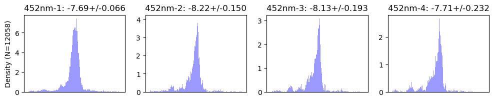
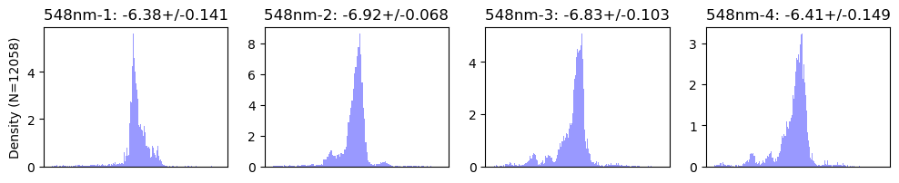
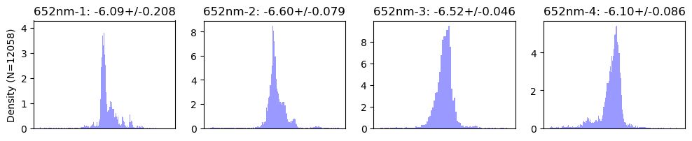
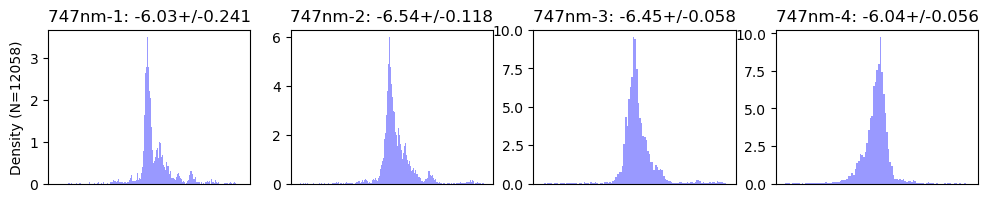
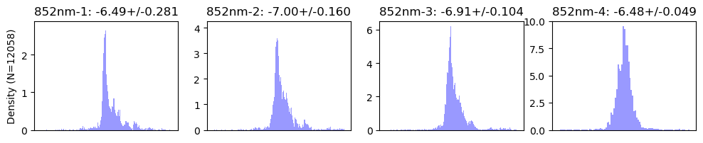
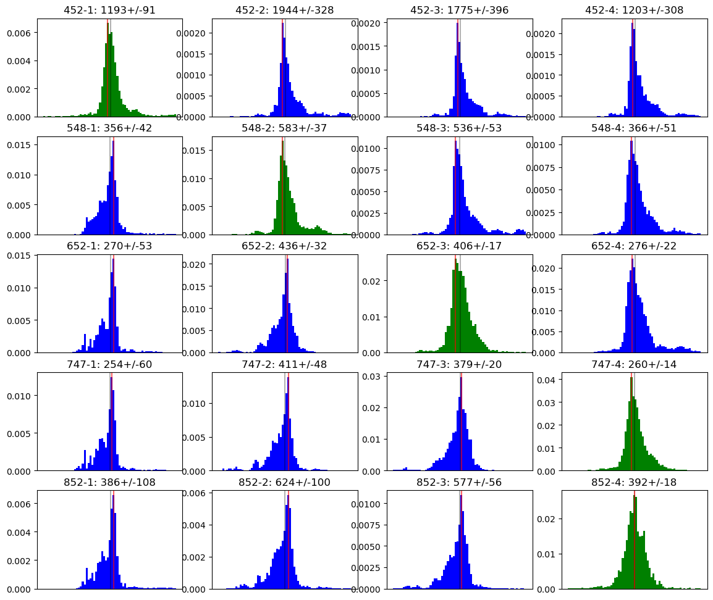

# Determine the Most Predictive Exposure Meter Bin for Each Science Wavelength

One use case for the exposure meter is that it can be used to terminate the exposure when a certain signal level is reached.  In this mode, we want the exposure meter to predict the signal at one of the DRP's chosen wavelengths.  Which exposure meter wavelength bin is the best predictor for each of the DRP wavelengths?  To determine this we will look at the spread in zero point difference values and choose the exposure meter bin with the narrowest spead for each spectrograph wavelength.

Naievely we would expect the correspondance to follow the wavelengths and that is what we get from this analysis, but it is reassuring to see that confirmed.


```python
from pathlib import Path
import yaml
import numpy as np
from astropy import stats
from astropy.time import Time
from astropy.table import Table, MaskedColumn
from kpf_etc.etc import kpf_photon_noise_estimate

import matplotlib.pyplot as plt

data_file = 'data/Feb2026_withInstZPs.csv'
t = Table.read(data_file, format='ascii.csv')
```


```python
wavs = ['452', '548', '652', '747', '852']
EMbins = [1, 2, 3, 4]
```

# Find the "Best" Exposure Meter Bin for Each Science Wavelength

Look at the spread in zero point differences and find the Exposure Meter Bin with the least scatter in zero poitn differences and use that at the "best" exposure meter bin to use for the science wavelength under test.


```python
def find_best_ExpMeterBin(t, wav, plot=True):
    EMwav = {1: ' 498nm',
             2: ' 604nm',
             3: ' 710nm',
             4: ' 817nm',
             }

    if plot: plt.figure(figsize=(12,2))
    comparison_stddev = []
    comparison_median = []
    for EMbin in EMbins:
        ZPdiff = t[f'ZP_{wav}'] - t[f'EMZP_{EMbin}']
        mask = t[f'ZP_{wav}'].mask | t[f'EMZP_{EMbin}'].mask
        mean, median, stddev = stats.sigma_clipped_stats(ZPdiff[~mask])
        comparison_stddev.append(float(stddev))
        comparison_median.append(float(median))
    
        plt.subplot(1,4,EMbin)
        plt.title(f'{wav}nm-{EMbin}: {median:.2f}+/-{stddev:.3f}')
        bins = np.arange(median-10*stddev, median+10*stddev, 0.01)
        plt.hist(ZPdiff[~mask], bins=bins, color='b', alpha=0.4,
                 density=True, log=False)
        
        if EMbin == 1: plt.ylabel(f'Density (N={len(ZPdiff)})')
        plt.gca().set_xticks([])
        plt.xlabel(f'')
    
    plt.show()
    best_EMbin = EMbins[np.argmin(comparison_stddev)]
    return best_EMbin, EMwav[best_EMbin].strip()
```


```python
best_EMbin = {}
for wav in wavs:
    EMbin, EMwav = find_best_ExpMeterBin(t, wav, plot=True)
    best_EMbin[wav] = EMbin
```


    

    


    

    


    

    


    

    


    

    


```python
best_EMbin
```


    {'452': 1, '548': 2, '652': 3, '747': 4, '852': 4}


# Save Results to Disk


```python
EMbinfile = Path('data/ExpMeterBins.yaml')
if EMbinfile.exists(): EMbinfile.unlink()
with open(EMbinfile, 'w') as f:
    f.write(yaml.dump(best_EMbin))
```

# Look at Conversion Factors

This is doing the same examination as above, but in linear space instead of log space (magnitudes).  We're doing this purely as a verification step to make sure we get the same result.


```python
for wav in wavs:
    for EMbin in EMbins:
        t.add_column(MaskedColumn(t[f'TOTCORR_{EMbin}']/t[f'SNRSC{wav}']**2), name=f'CV_{wav}_{EMbin}')
        t[f'CV_{wav}_{EMbin}'].mask = t[f'TOTCORR_{EMbin}'].mask | t[f'SNRSC{wav}'].mask | (t[f'TOTCORR_{EMbin}'] <= 0) | (t[f'SNRSC{wav}'] <= 0)

```


```python
conversion = {}

plt.figure(figsize=(14,12))
for i,wav in enumerate(wavs):
    for EMbin in EMbins:
        best = best_EMbin[wav] == EMbin
        hcolor = {True: 'g', False: 'b'}[best]
        plt.subplot(5,4,i*4+EMbin)
        conversions = t[f'CV_{wav}_{EMbin}'][~t[f'CV_{wav}_{EMbin}'].mask]
        Nc = len(conversions)
        mean, median, stdev = stats.sigma_clipped_stats(conversions)
        bins = np.arange(median-7*stdev, median+7*stdev, np.ceil(stdev)/5)
        n, b, _ = plt.hist(conversions, bins=bins, color=hcolor, density=True)
        wmode = np.argmax(n)
        mode = (b[wmode]+b[wmode+1])/2
        if best:
            conversion[f"{wav}"] = float(median)
        title = f"{wav}-{EMbin}: {median:.0f}+/-{stdev:.0f}"
        plt.title(title)
        plt.axvline(median, color='k', alpha=0.3, label='median')
        plt.axvline(mode, color='r', alpha=0.6, label='mode')
        # plt.legend(loc='best')
        plt.gca().set_xticks([])
plt.show()
```


    

    


### Discussion

From this we get the conversion rate between Exposure Meter ADU and spectrograph detected photons which we can compare against the previously calculated zero point difference and see that they are consistent.


```python
for wav in wavs:
    print(f"{wav}nm: {conversion[wav]:4.0f} EMADU/photon = {-2.5*np.log10(conversion[wav]):.2f} mag zero point difference")
```

    452nm: 1193 EMADU/photon = -7.69 mag zero point difference
    548nm:  583 EMADU/photon = -6.91 mag zero point difference
    652nm:  406 EMADU/photon = -6.52 mag zero point difference
    747nm:  260 EMADU/photon = -6.04 mag zero point difference
    852nm:  392 EMADU/photon = -6.48 mag zero point difference

