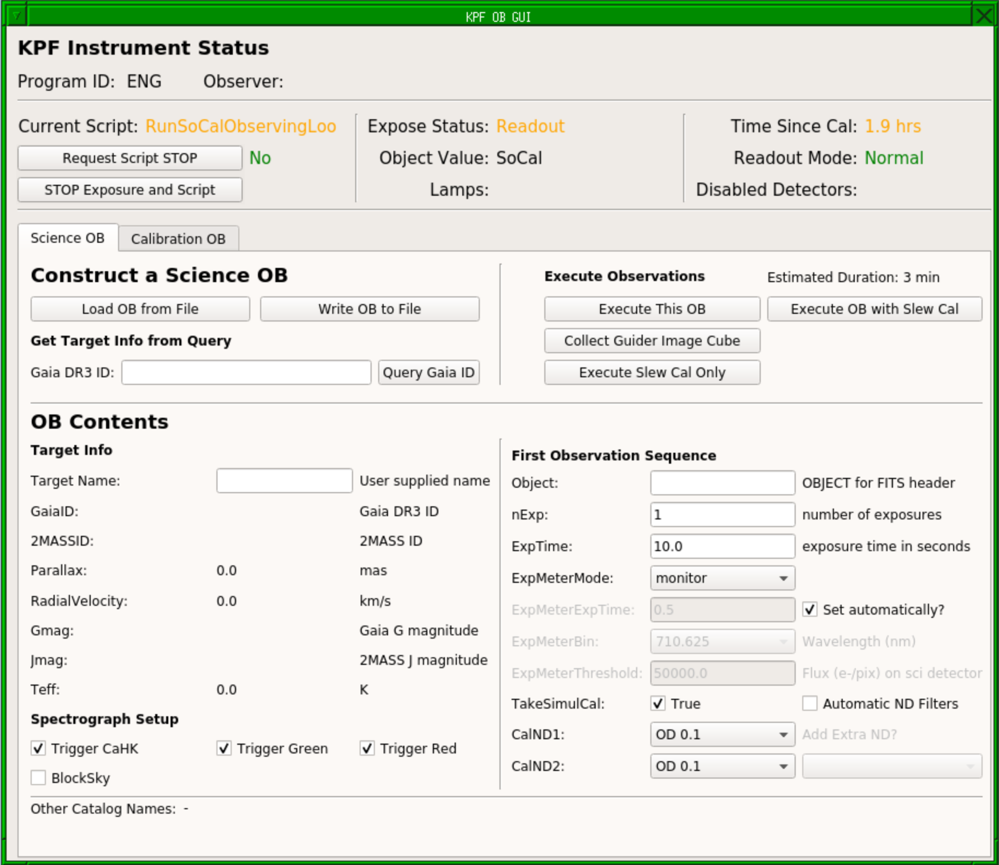

# Afternoon Setup

The afternoon setup process for the instrument itself is minimal. Calibrations are automated, so unless you have very special requirements for your observation (if so please contact the Staff Astronomer supporting your night in advance), then observers will not need to execute any calibrations.

Prior to starting observing, observers should run: `KPF Control Menu --> Start KPF GUIs` from the background menu (or `kpfStartUp` from the command line on any KPF machine). This will:

 * Configure the output directories
 * Set the observer names based on the telescope schedule
 * Start the KPF GUIs

This can be run at any time prior to observing. If automated calibrations are in progress, this may take several minutes as certain operations can only be done while the detectors are not exposing.

# Preparing Observing Blocks (OBs)

Observers should use the afternoon to prepare Observing Blocks (OBs) and their star list if they have not done so already. 

The basic unit of KPF nighttime operations is the Observing Block (OB). An OB describes a single visit to a science target and the observations made there. The data in an OB can be divided in to 4 rough categories:

**Target information**: The OB will contain information about the target beyond what is in a typical Keck Star List entry in order to flow that information to the FITS header and the data reduction pipeline (DRP).

**Guide camera configuration**: The OB will also contain information about how to configure the guide camera and tip tilt system for this target.

**Instrument Setup**: The OB will also contain information about how to configure the instrument for this set of observations.

**Observations**: Finally, the OB will contain a list of "observations" to be made of the target. For typical KPF observers, this will only have one entry, but multiple entries are supported. Each entry describes a set of exposures on the target and contains the information on how those exposures should be executed.

The data contained in the OB is a set of keyword-value pairs. Observers can prepare OBs as text files which can be read in by the KPF software and executed or (once logged in to the KPF VNCs) they can use tools there to build the OBs and save them as files. 

## KPF OB GUI

A graphical tool has been built to help observers build their KPF OBs, it is launched automatically as part of the script to start all GUIs.

>  A screenshot of the KPF OB GUI. This tool is still under development and may change.

The top section of the GUI, "Instrument Status" shows whether an instrument script (e.g. an observation or calibration set) is being run and allows users to request that script stop.

The middle section can be used to load an OB from a file, build an OB from scratch using a Gaia DR3 catalog query, save the OB to a file, or execute the OB.

The lower section is where a user can fill out the OB parameters as described in the "KPF Science OB Contents" section above.
