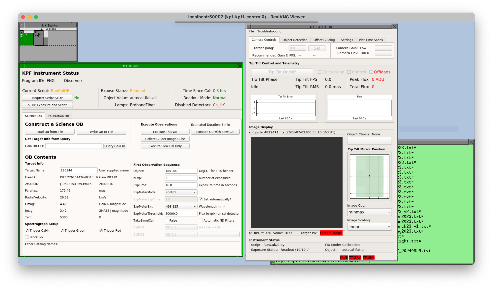
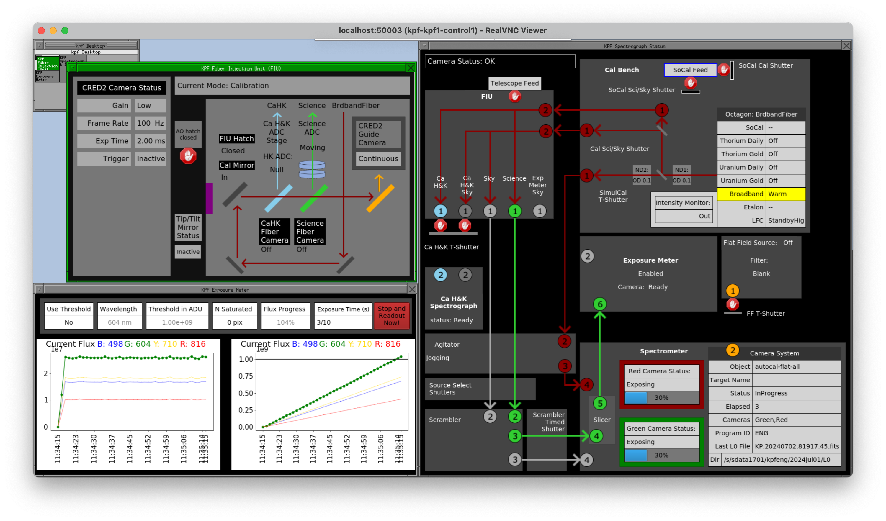
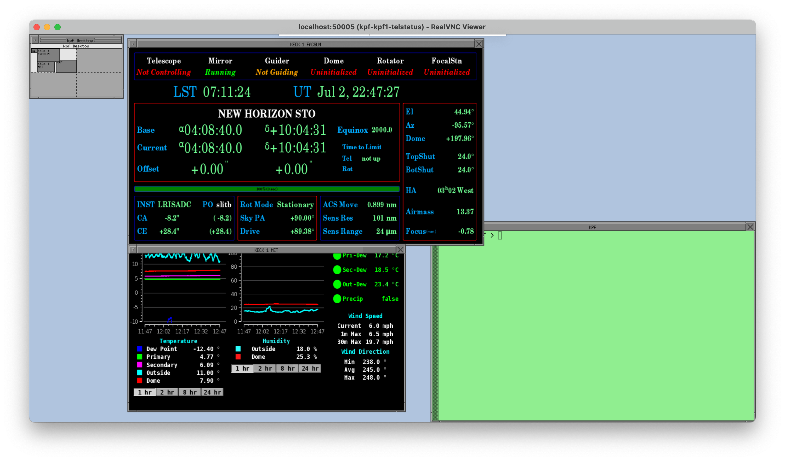

# Afternoon Setup

The afternoon setup process for the instrument itself is minimal. Calibrations are automated, so unless you have very special requirements for your observation (if so please contact the Staff Astronomer supporting your night in advance), then observers will not need to execute any calibrations.

Prior to starting observing, observers should run: `KPF Control Menu --> Start KPF GUIs` from the background menu (or `kpfStartGUIs` from the command line on any KPF machine). This will start the KPF GUIs and can be run at any time prior to observing. 

# Preparing Observing Blocks (OBs)

Observers should use the afternoon to [prepare Observing Blocks (OBs)](buildingOBs.md) and their star list if they have not done so already. 

# Connecting to VNCs

Observers can connect to the Keck VNCs to control the instrument from Keck HQ in Waimea, one of the Keck Remote Observing Stations, or from home using the Remote Observing Software.  For details, see the [Remote Observing](https://www2.keck.hawaii.edu/inst/mainland_observing/) documentation.

# Starting KPF GUIs

The KPF GUIs can be started at any time.  To do so, choose `KPF Control Menu -> Start KPF GUIs` from the FVWM menu.  Check that the GUIs come up properly in the various VNC sessions.  Each session is described below.

### control0

The `control0` VNC session should contain:

- **OB GUI**: This is where the observer can build and execute observing blocks.
- **Tip Tilt GUI**: This is a view-only version of the GUI the OAs use to control the tip tilt system. Observers can use this to see the tip tilt system status and images, but observers can not control the system.

### control1

The `control1` VNC session should contain:

- **FIU GUI**: This shows the status of the FIU including the light path.  This is a good place to look if you are not seeing stars on the guider and want to know if the guider should eb seeing the sky.
- **Exposure Meter GUI**: This will show the progress of the flux measured by the exposure meter over the course of a single exposure.
- **Spectrograph GUI**: This shows the staus of the overall instrument (including a simplified FIU status). The light paths which are illuminated will show up as colored lines and arrows here to indicate where light is being directed by the various components.

### control2

The `control2` VNC session should contain:

- A **ds9** instance which shows the latest raw image from the Ca H&K, Green, and Red detectors.
- **Eventsounds GUI**: This is a standard Keck GUI where the users can enable/disable sounds and change what sound is produced by a given event.

### telstatus

The `telstatus` VNC session should contain:

- **FACSUM**: A standard Keck GUI showing the status of the facility (telescope and dome).
- **XMET**: A standard Keck GUI showing various weather telemetry values. The OAs have more weather information which is not shown here, but this is a good summary.
- **Magiq Observer UI**: A standard Keck GUI for viewing guider images and interacting with star lists.

Note that the Magiq UI may not come up if the StartGUIs script was run while KPF was not the selected instrument.  The Magiq UI will always come up with the guider for the selected instrument when launched.  If Magiq is not running, launch it via `Telescope GUIs --> Magiq Guider UI` from the FVWM menu.