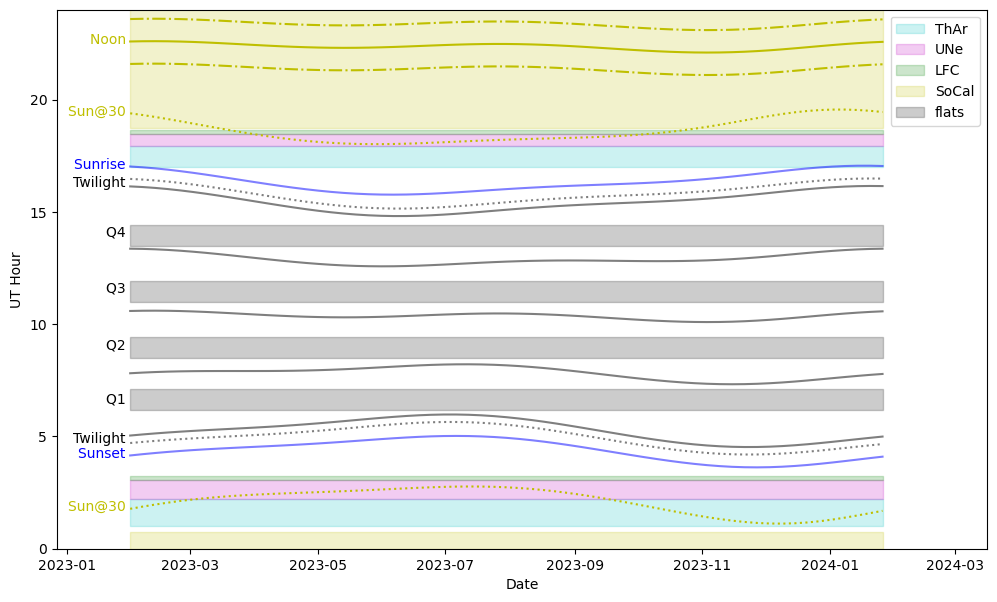

# Calibrations

KPF observers do not need to take afternoon cals because the calibration system is automatic (driven by cron jobs).  This is important to PRV science as to get the best RVs, the instrument and its daily cycles need to be characterized, so we want to sample the calibrations in a systematic and repeatable way each day.

The calibration schedule is a trade off between several factors. Because we want the calibrations to happen at a consistent time each day, we start the daily schedule based on the latest sunrise and the earliest sunset of the year.

The calibrations can be broadly divided in to several categories described in the Types of Calibrations section below.

# The Daily Calibration Schedule

Each day, the calibrations described below are executed.  The needs of KPF are such that each day is  filled as much as possible by calibrations.  The diagram below shows what that schedule looks like over the course of a year as the sunrise and sunset times evolve with the seasons.

This figure shows how the KPF calibration schedule interacts with the nighttime schedule over the course of a year (the 23A & B semesters in this case). The various lines show how daily events such as sunrise and sunset evolve in UT time. The lines are labeled on the left side of the plot. The shaded regions are the approximate duration of the scheduled calibrations.

Even if no KPF observations are scheduled, the calibrations occupy 816 minutes (more than 13.5 hours) each day, or about 57% of the day.  The gaps in this schedule are driven the desire to avoid having calibrations in progress when someone might be starting to operate the instrument: near sunset and at each of the quarter night boundaries.

# Types of Calibrations

#### Wavelength Calibrations

Wavelength calibrations are the most critical daily calibration.  Absolute wavelength calibrations use the laser frequency comb (LFC) or one of the hollow cathode lamps (ThAr or UNe).

The etalon is also used for wavelength calibration, but in a slightly different way.  The etalon spectrum is not fixed to absolute wavelengths as the LFC and the Thorium and Uranium lamps are, but it has the advantage of being far more robust. The positions of the etalon lines can evolve slowly with time, but on short (<1 day) timescales they are stable.  Thus the etalon calibration frames can be used to track the evolution of the instrument over daily timescales (anchored by the morning and afternoon wavelength cals).  Thus it is valuable to have etalon observations taken periodically throughout the day and night.

#### Broadband Flats

KPF takes relatively standard spectral flats using a broadband lamp.  Because of the extreme requirements for PRV measurements, the flats must be extraordinarily high signal to noise and be taken daily to track any changes.

#### Biases and Darks

KPF takes biases and darks like other instruments. We try to schedule these in to the lamp warmup time built in to other calibrations, so they end up being spread out throughout the day during other calibration OBs.

#### Other Calibrations

We currently also take two other calibrations: a set of biases for the Exposure Meter every day and a set of CRED2 guide camera biases a couple times per week.

# Overnight Etalon

In addition to the calibrations taken during daytime, we have scheduled four long calibration sequences to happen overnight.  The start times are chosen so that they should not be in progress when an observer might be starting use of the instrument (e.g. at a quarter night boundary).  The scheduled cals will not begin during observations because the `kpfStartOfNight` script sets the `kpfconfig.ALLOWSCHEDULEDCALS` keyword to “No” and the script to run the overnight calibrations respects that keyword.

If for some reason, they are running when an observer needs to being observing, the cals can be stopped using the standard tools to halt a script in progress (e.g. the “Request Script Stop” button in the OB GUI).