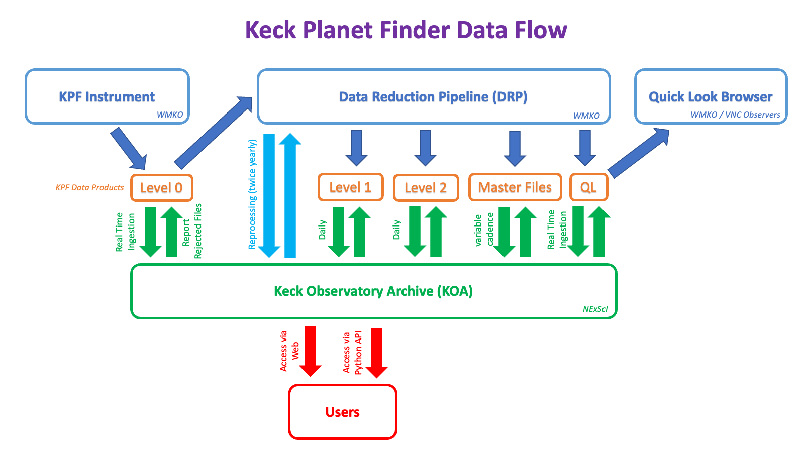

# Data Flow

> An idealized vision for the KPF data flow. This is still a work in progress.

## Raw Data

Because KPF contains many detectors, but they are all synchronized in time, the raw data is immediately combined in to a "Level 0" (L0) multi-extension FITS file by the `kpfassemble` dispatcher.  Most users will want to use that L0 data for analysis or inspection.

Each detector writes data to a separate output directory and `kpfassemble` will collect them from these to generate the L0 file.  This is a relatively quick process, typically the L0 file is written a few seconds after the component raw data are available on disk.

As mentioned on the [detectors](detectors.md) page, the Green and Red detectors have 32 bit ADCs and thus the pixel data do not fall on the usual 0-65535 range you may be used to.

## L0 Data

The L0 data is a multi extension FITS file consisting of the following HDUs:

| HDU # | HDU Name | Notes |
| ---------- | -------- | ----- |
| 0  | PRIMARY | Header only, no image data |
| 1  | GREEN_AMP1 | Green image data |
| 2  | GREEN_AMP2 | Green image data |
| 3  | RED_AMP1 | Red image data |
| 4  | RED_AMP2 | Red image data |
| 5  | CA_HK | Ca H&K image data |
| 6  | EXPMETER_SCI | Table of processed exposure meter spectra |
| 7  | EXPMETER_SKY | Table of processed exposure meter spectra |
| 8  | GUIDER_AVG | The average guider image over the duration of the exposure |
| 9  | GUIDER_CUBE_ORIGINS | Table of telemetry from the tip tilt system |
| 10 | TELEMETRY | Table of instrument telemetry |

This can change depending on the composition of the science observation.  For example, if the Ca H&K detector was not triggered, that extension would not be used.

## Keck Observatory Archive (KOA)

The L0 data are immediately sent to KOA for archiving.  Observers can "subscribe" to the L0 data via KOA's [Real Time Ingestion (RTI)](https://koa.ipac.caltech.edu/rti-gui/login) interface.

# Data Reduction

The [KPF Data Reduction Pipeline](kpfdrp.md) was built and delivered by the KPF Instrument Team and is an important part of obtaining the desired performance from the instrument.

While Keck plan's to eventually run the DRP locally and provide quick look products (QLP), L1, and L2 data to observers as part of the KOA RTI interface, the KPF DRP is still under active development by the KPF science team, so the Keck deployment of the DRP is on hold until there are less frequent changes for us to track. As a result, data for programs which have partnered with CPS are available through their instance of the DRP which is run on the CPS Team's hardware.  Observers who are not part of CPS should contact their Keck SA to arrange for access to reduced data products.
