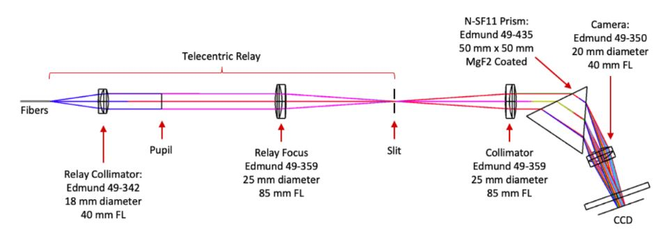

# Exposure Meter

An accurate measurement of the time of the flux-weighted midpoint of each exposure is essential to correct for the barycentric velocity of the Earth. During an exposure, a small fraction of the light within the spectrometer is diverted to a separate, low-resolution spectrometer that records the flux time series for all wavelengths across the main spectrometer bandpass. This system accurately tracks the photon arrival times in the parent spectrometer, allowing for precise determination of flux-weighted exposure mid-points as a function of wavelength.

The optical design of the exposure meter is a prism-based spectrometer with a resolving power of approximately 100. The exposure meter accepts light from two fibers; one collecting light from the otherwise unused outboard slices of the science fiber at the spectrometer reformatter entrance, and a sky fiber from the fiber injection unit on the telescope. The optical design is shown in the following figure. 

> Optical design of the KPF Exposure Meter
