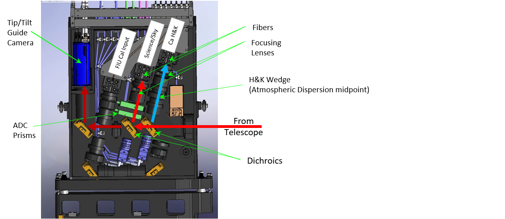
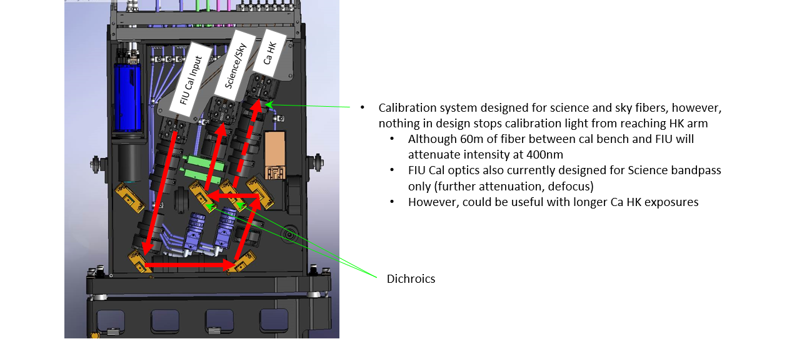

# Fiber Injection Unit (FIU)

The Fiber Injection Unit (FIU) sits on the Keck I AO bench ahead of AO correction. The unit's primary role is to feed telescope light to the science, sky, and Ca H&K fibers. The unit utilizes a pair of dichroics to send light to the relevant subsystems:

| Wavelength Range | Subsystem | Notes |
| ---------------- | --------- | ----- |
| 382-402 nm | Ca H&K Spectrograph | Includes two fibers (science and sky)
| 445-870 nm | Science Spectrograph | Includes two fibers (science and sky)
| 950-1200 nm | Guide Camera | Used for acquisition and fast tip tilt correction

The FIU can also be configured in a mode which takes light from the calibration bench in the basement and injects it in to the science and sky fibers.

## Atmospheric Dispersion Correctors

In addition, the FIU contains atmospheric dispersion correction (ADC) systems for both the science and Ca H&K wavelengths.

### Science ADC

For the science arm, a pair of prisms are rotated to provide dispersion correction based on the telescope position. The ADCs are designed to keep all the science wavelengths within 50 mas.  The ADC corrects atmospheric dispersion at that full 50 mas specification down to an elevation of 30 degrees.  The prisms reach their maximum correction power at an elevation of 25 degrees, beyond that, their correction power is fixed and no longer increases as the elevation decreases.

### Ca H&K ADC

For the Ca H&K arm, the fiber is on a two axis stage and is translated in such as way as to place the fiber under the correct wavelengths of light. The total wavelength range in this arm is small enough that only the differential position between this arm and the science and guide arms is corrected, there is no correction of the dispersion over the narrow wavelength range of the Ca H&K arm.

## FIU Layout

> The FIU layout when in science mode. Light from the telescope is directed to the FIU off of a tip tilt mirror located on the PCU stage.

> The FIU layout when in calibration mode. The calibration fibers are illuminated and a fold mirror is moved in to place to direct their light on to the science fiber. 

## Fiber Viewing Cameras

Both the science arm and the Ca H&K arm have fiber viewing cameras (FVCs) for imaging the fiber tip.  These are only useful in an engineering context as it takes a very bright (roughly 1st magnitude) star to be visible because the FVCs are looking through the dichroics (and the ADC prisms in the science arm).  This drastically reduced the amount of light to the FVCs and makes the images hard to interpret due to reflections and ghost images.