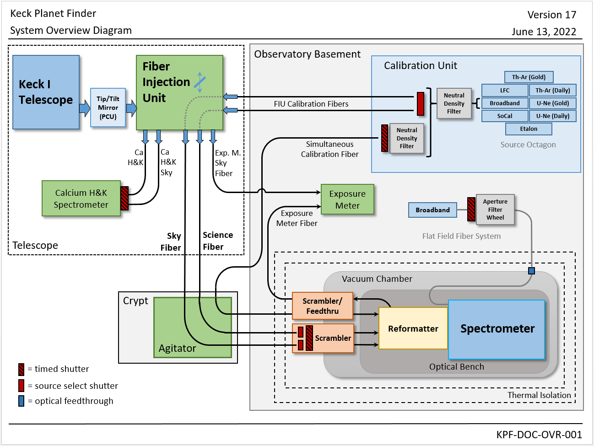
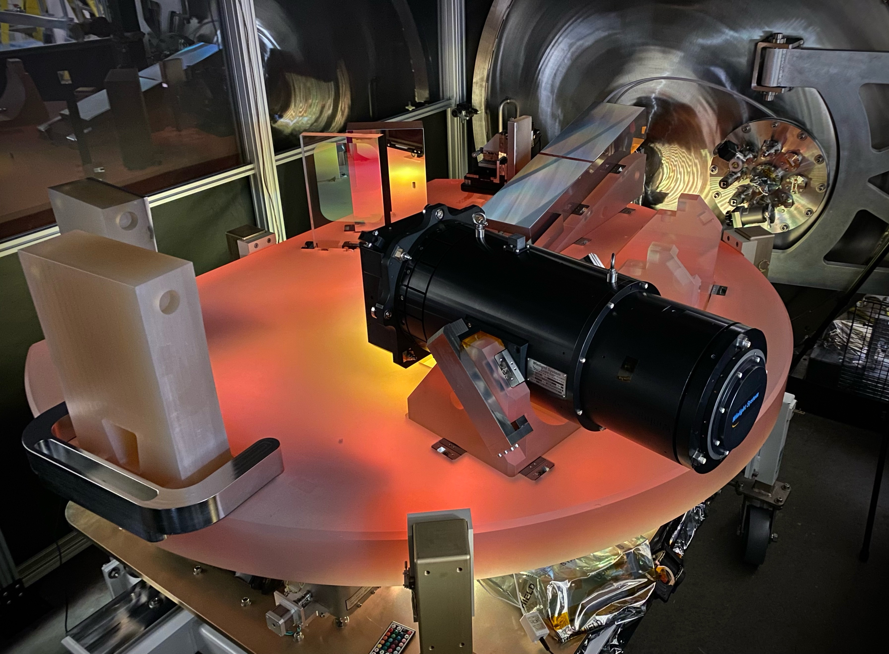

# Keck Planet Finder (KPF)

| Email Contact: | [kpf_info@keck.hawaii.edu](mailto:kpf_info@keck.hawaii.edu) |
| -------------- | ---------------------- |
| Instrument Scientist: | Josh Walawender |
| Deputy Instrument Scientist: | Sherry Yeh |

## Instrument Status

KPF has been commissioned on sky, and is available for use. Many aspects of the instrument are still being optimized and the long term stability is still under evaluation. Short term stability looks excellent (exceeding the 50 cm/s target spec within a night) and we expect measures of the long term RV precision to become available as the DRP evolves.

A detailed summary of the instrument status was presented at the September 2023 Keck Science Meeting. The slides from that presentation are available in [PDF format](Keck Science Meeting 2023 Breakout Session.pdf).

**Important Notice**: KPF will have a lengthy “servicing mission” during 24B to perform several upgrades.  This will involve warm up of the optical bench.  The expected timeline is to do this in November 2024.  Details are still being worked out.

### Subsystem Status

This is an attempt to summarize the status of various sub-systems of the instrument.  Each sub-system name is color coded to indicate the status at a glance: green means functioning normally, orange means mostly normal, but with some caveats or minor issues, and red means the sub-system is compromised in some way.

- Tip Tilt Corrections: The tip tilt stage was replaced in early June 2024 and is now working as expected.
- Ca H&K Detector: Currently functional.
- Double Star Observations: Recent modifications to the tip tilt system should enable double star observations.  There is still learning curve as we figure out how to optimize source detection though, so be patient with the OAs while trying to do this.  Remember that this is not the same as the MAGIQ guiding system, so your intuition there does not transfer to KPF.
- Etalon: The etalon flux problem was fixed during the servicing mission in Feb 2024 and it is now provided the expected flux levels. We have not yet worked out an algorithm for recommending ND filter settings for a given observation to balance SimulCal five flux with science fiber flux, but the mode is available. We are still recommending that slew cals should be taken every hour.
- LFC: Is operating normally. Standard exposure parameters are now `ExpTime: 60, CalND1: OD 2.0, and CalND2: OD 0.1`.
- Detector Systems: The red and green detectors suffer from occasional “start state errors” in which the affected detector remains in the start phase and does not produce a useful exposure. The observing scripts now detect this occurrence, abort the current exposure (with read out) and start a fresh exposure on both cameras. No action is necessary on the part of the observer.  This costs about a minute of time for this to happen, but the resulting data should be normal (unless another error occurs).  The occurrence rate for these problems is 0.34% on the green detector and 0.22% on the red, so around one in every 180 exposures is affected by one of the two detectors experiencing this error.
- Exposure Meter Terminated Exposures: The control system supports exposure meter terminated exposures (ExpMeterMode: control in the OB), however we are still verifying performance on sky.
- Nod to Sky Observations: Nodding away to a sky position can be accomplished manually by running separate OBs for the target and sky and asking the OA to offset the telescope as appropriate.  We plan to build a separate Nod To Sky observing mode which will accomplish this within a single OB, but that is not yet ready.
- Off Target Guiding: Not yet commissioned.  Currently, the tip tilt system must be able to detect the science target in order to position it on the fiber.

## Instrument Description

The Keck Planet Finder (KPF) is a fiber-fed, high-resolution, high-stability cross dispersed, spectrometer designed to characterize exoplanets via Doppler spectroscopy with a goal of a single measurement precision of 0.3 m/s or better. KPF covers a wavelength range of 445 nm to 870 nm over green and red channels.

KPF consists of 3 independant spectrographs:

* The primary science spectrograph described above which is designed to be highly stable and has both a green and red arm. The spectrograph optical bench is made from low expansion Zerodur and is kept is a temperature stabilized environment.
* A Calcium H&K spectrograph which gets the light blueward of the main science spectrograph and is used to simultaneously measure stellar activity using the Ca H&K lines.
* The exposure meter spectrograph which gets a portion of the science light and is used to measure the flux level during long exposures of the primary science detectors. The exposure meter both measures the time weighted flux midpoint of each exposure, and can also be used to terminate an exposure at a specified flux level.

All three spectrographs are fed by optical fiber from the Fiber Injection Unit (FIU) which sits on the Keck I AO bench. The light entering the FIU is not AO corrected, but is fed off a fast tip tilt mirror which is used to maintain the target star's position on the science fiber within 50 mas rms of the fiber center. Performance of the tip tilt loop is to be confirmed during commissioning.

During observations, the spectrograph can be fed with light from a simultaneous calibration fiber. This places calibration light alongside science and sky spectra in the pseudo-slit. The calibration light is fed from the calibration bench which contains several calibration sources.

In addition to the simultaneous calibration light, the calibration bench can be configured to feed light up to the FIU and through the science and sky fibers in order to bring cal light in to the science and sky portions of the pseudo-slit.

> The system overview diagram showing the relationships between the different subsystems of the instrument.

> KPF's Zerodur optical bench during integration at the Space Sciences Lab at UC Berkeley. The echelle grating can be seen at the upper right.

