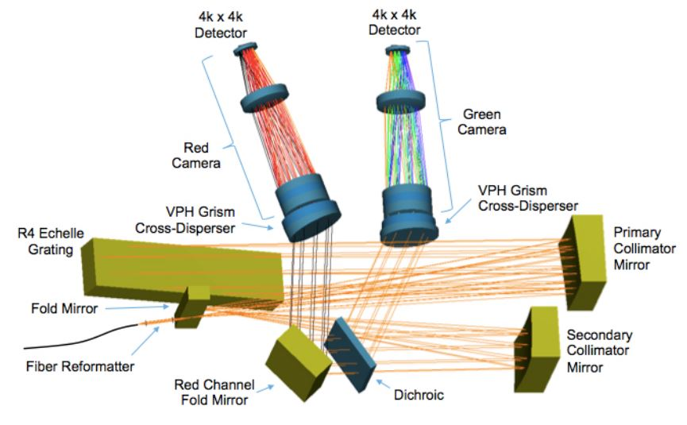
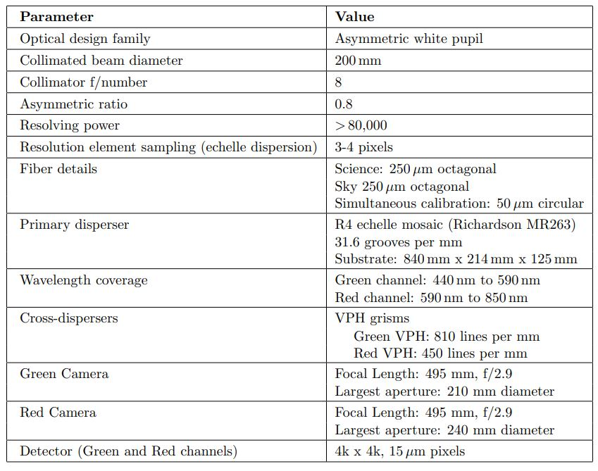
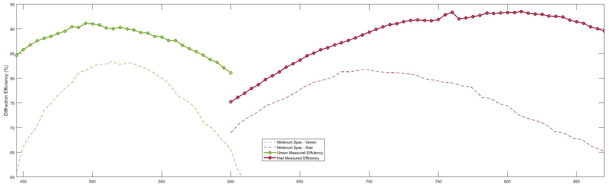

# Spectrometer Optical Design

The baseline KPF spectrometer design is shown in the following figure. Light enters the core spectrometer following the fiber image reformatter, at the focal point of the primary collimator mirror (traditionally this would be the location of the spectrometer slit). The f/8 beam diverges past this point and then strikes the primary collimator mirror (an off-axis paraboloid). Upon reflection, the now collimated 200 mm diameter light beam travels to the echelle grating, located one primary collimator focal length away from the primary collimator. After diffraction by the echelle, the diverging monochromatic beams reflect from the primary collimator a second time. Because the echelle grating is rotated slightly out of plane (the echelle gamma angle), the dispersed light does not return along the same path, and the pre- and post-diffraction beams are separated. Therefore, after reflecting from the collimator the second time, the dispersed light does not return to the entrance slit, but forms an intermediate focus to the side of the echelle. Just before the intermediate focus, a flat mirror is employed to fold the beam, to make the spectrometer footprint more compact.

>Layout of the spectrograph on the optical bench.

After the fold mirror reflection, the light rays go through the intermediate focus, and then the diverging monochromatic beams are collimated by the secondary collimator mirror (an off-axis paraboloid). The monochromatic beam diameter here is 160 mm, owing to the secondary collimator having a focal length 0.8x that of the primary collimator. The converging monochromatic beams next encounter a dichroic beamsplitter, where wavelengths blueward of 593 nm are reflected, and wavelengths redward of 593 nm are transmitted. After reflection, the green channel monochromatic beams continue to converge towards the white pupil, where the cross-dispersion grism (grating prism) is located. This disperser consists of a shallow apex angle prism bonded to a volume phase holographic (VPH) grating. Following the grism, the light enters the camera, which then focuses the spectrum onto the CCD detector. A summary of various spectrometer parameters is given the the following table.

>A brief summary table of KPF instrument properties.

# VPH Grating Overview

As described above, the main spectrometer employs VPH-based grisms for cross-dispersion. In order to provide sufficient cross dispersion, the green channel VPH grating was produced with a line density of 800 lines per mm and the red channel VPH with 450 lines per mm. A summary of the KPF VPH grating specifications are shown in the table below. Both gratings were produced by Kaiser Optical Systems (KOSI). 

>A brief summary table of KPF's VPH grating properties.

A preliminary set of diffraction efficiency measurements was conducted by KOSI at a few locations across the clear aperture for each KPF grating. These data were re-measured and confirmed at SSL using the measurement test equipment and procedures developed by the DESI project. Overall, we were able to confirm KOSI's measurements and saw a slight (2-4%) increase in diffraction efficiency. The optimum angle of incidence (AOI) for each grating were both chosen away from their design AOI due to gains in diffraction efficiency at the "blue" end (green grating) and "red" end (red grating) of the KPF passband. For the green grating, we chose an AOI of -29.5 degree which incrased the overall band average efficiency from 86.4 degree to 87.7 degree. This increased the blue end efficiency from 77.6% to 84.6%. For the red grating, we chose an AOI of -25.4 degree which slightly increased the overall band average efficiency from 87.7% to 88.6%. This increased the red end efficiency from 82.7% to 89.6%. The following figure shows the SSL measured efficiency of the two KPF VPH gratings over the spectrometer's passband. With the changing of the AOI in each grating, we have seen significant gains (approximately 25%) in diffraction efficiency vs. the production minimum specification at both ends of the spectrometer passband. Overall these grating exceeded our production minimum specification by >5% across at all wavelengths with the noted gains at the "blue" and "red" ends of the KPF spectrometer passband.

>Plot of the VPH grating efficiency as a function of wavelength.

