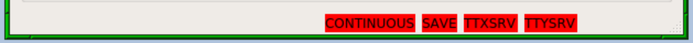

# Tip Tilt Instructions for OAs

#### Table of Contents

1. [TL:DR Procedure](#tldr-procedure)
1. [Tip Tilt System Overview](#tip-tilt-system-overview)
1. [Tip Tilt GUI](#tip-tilt-gui)
    - [GUI Layout](#gui-layout)
    - [Camera Controls Tab](#camera-controls-tab)
    - [Object Detection Tab](#object-detection-tab)
    - [Offset Guiding Tab](#offset-guiding-tab)
    - [Settings Tab](#settings-tab)
    - [Plot Time Spans Tab](#plot-time-spans-tab)
    - [Tip Tilt Control and Telemetry](#tip-tilt-control-and-telemetry)
    - [Image Display](#image-display)
    - [Instrument Status](#instrument-status)
    - [Status Bar](#status-bar)
1. [Star Detection Algorithm](#star-detection-algorithm)
1. [Deblending Multiple Stars](#deblending-multiple-stars)

# TL:DR Procedure

1. Set the gain and FPS values for the guide camera.
1. Acquire the star to the KPF PO using magiq.
1. In the KPF Tip Tilt GUI, turn on the tip tilt loops.
1. Verify normal operation of the loops (this should just require a momentary glance at the various indicators):
    - Make sure the science target has been indentified.  It should have a circle around it and a label in the image display part of the GUI.
    - Check that an object has been selected in "Object Choice".
    - Check that the Peak Flux is sufficient (the value will be color coded to help you). If needed, adjust the gain and FPS.
    - Check that the Tip Tilt Error is decreasing over time in the plot. This indicates that the star is being moved to the target pixel.
    - Check the "Tip Tilt RMS" value is around 50 mas or better. If the target is faint or there are heavy clouds or bad seeing, it may not be able to reach this, but under normal conditions we should at least be in the ballpark.
    - If there are multiple stars in the field of view, ensure that the corect target is selected and that the stars are not blended.  Each detected star will have its own OBJECTn label in the image display: **make sure this is centered on the star**.
1. Inform the observer that the tip tilt loops are engaged and they can begin exposing.

## Troubleshooting the TL:DR Procedure

- If the system is not seeing the target star, adjust the "Detect SNR" and/or "Detect Area" values under the Object Detection tab in the GUI (see [Star Detection Algorithm](#star-detection-algorithm) section below for details).
- If the system seems to be having trouble identifying stars, toggle the loops on and off (this is primarily for the Calculation loop). Doing this will cause the algorithm to re-identify the stars and may resolve ID confusion caused when stars are moving rapidly in the field.
- Check that there are no red indicators in the status bar at the bottom of the Tip Tilt GUI.  These indicate that something substantial is wrong.  Which indicator it is will tell you which keyword or dispatcher is in a bad state.

# Tip Tilt System Overview

The KPF tip tilt system takes fast (e.g. 100 FPS) subframe images from the KPF CRED2 guide camera in order to control the fast tip tilt mirror which directs light in to the KPF FIU.  This fast tip tilt system maintains the stellar position on the science fiber.  This is critical not for reasons of maximizing flux in to the spectrograph (though that is a side benefit), but to optimize the radial velocity measurement.

Even after fiber scrambling and agitation, if the star’s position on the fiber entrance fiber shifts, that can manifest as a small shift of the spectrum on the detector which would be interpreted as a radial velocity change.  Thus we need to position the star on the fiber, and then hold it in a consistent place during observations and make that position consistent from observation to observation.

### Tip Tilt Loops

There are several components to the tip tilt loops.  Controls for toggling them on and off together and individually are provided in the [Tip Tilt Control and Telemetry](#tip-tilt-control-and-telemetry) section of the Tip Tilt GUI.  The important pieces are:

**Calculation**: The calculations are the part of the algorithm which is examining images from the guide camera, detecting and identifying objects, and calculating the relevant tip tilt commands.  This can be toggled on and off using the underlying `kpfguide.TIPTILT_CALC` keyword.

Note that once calculations are turned on the system is attempting to cross identify stars from image to image and maintain a consistent identity.  One of the things it uses to do this is knowledge of the average positions of stars in recent images.  Thus, if the stars are moved dramatically (e.g. by Magiq), it may confuse the IDs.  If you think this might be the case, restarting calculations will force a fresh identification phase.

**Control**: The control component takes the output of the calculations loop and sends commands to the tip tilt mirror.  As long as the motions needed are within range of the tip tilt mirror, this will close the loops and should yield a stable star position.  This can be toggled on and off using the underlying `kpfguide.TIPTILT_CONTROL` keyword.

**Offload**: If the motion of the star carries it toward the edfe of the tip tilt mirror's range of motion, the system will "offload" some of that movement to the telescope (akin to a normal guiding command).  Enabling offloads allows those commands to go to the telescope.  This can be toggled on and off using the underlying `kpfguide.OFFLOAD` keyword.

The `kpfguide.OFFLOAD` keyword will also attempt examine the telescope control system (`dcs`) to determine if offloads should be sent.  This permissive is based primarily on whether KPF is the selected instrument, if not, the instrument should not be sending offloads to the telescope.  The `kpfguide.OFFLOAD_DCS` keyword indicated whether KPF is permitted to offload and it must be "Yes" in order for offloads to be enabled.

# Tip Tilt GUI

To start the GUI, open a terminal as any kpf user (e.g. kpfeng) on the kpf machine and type: `TTGUI_v2`.  For dark mode, add the `-d` option to the command.

>  A screenshot of the Tip Tilt GUI.

The Tip Tilt GUI may also be opened for observers in "monitor" mode, in which case none of the controls are active, but the telemetry and image display can be seen.  To do this, use the `TTGUI_v2 --monitor` terminal command as above or select `KPF Control Menu -> Subcomponents -> Start Tip Tilt GUI` from the FVWM menu in a KPF VNC session.

## GUI Layout

The top section of the GUI (beneath the "File" and "Troubleshooting" menus), is a small tabbed interface with various controls and options. See the sections below on each tab.

Beneath the tabbed section is a region titled "Tip Tilt Control and Telemetry" this section contains control for the tip tilt loops and telemetry about the tip tilt performance.  See the [Tip Tilt Control and Telemetry](#tip-tilt-control-and-telemetry) section below for details.

Beneath that is a region titled "Image Display" which shows the latest Magiq image cropped to the region which the tip tilt system is using (a subframe of the whole field).  It also contains the tool for choosing which object in the field to guide on and controls for the image display stretch and cut.  See the [Image Display](#image-display) section below for details.

Beneath that is a region titled "Instrument Status" which contains a very brief summary of what the instrument is doing at the moment. See the [Instrument Status](#instrument-status) section below for details.

The very bottom of the GUI is the status bar which will be empty if everything is in a working state for observing.  See the [Status Bar](#status-bar) section below for details.

#### Camera Controls Tab

>  A screenshot of the Tip Tilt GUI's Camera Controls tab.

When the observer executes an OB (which they should do during the slew, but they may forget or not be ready, so check if you are unsure), then the target star's J band magnitude will be populated in this GUI.  This will also update the "Recommended Gain & FPS" values.  If you wish to accept these recommendations, simply click the "Set" button.  The recommendations will be color coded green if they match the current values or orange if they do not match.

The pulldown to the left of the "Set" button will add in some amount of extinction (in magnitudes) to the estimated values.  If you have clouds, you can put in some value for the extinction and the estimate will account for the clouds.

The right hand section of the tab shows the current Gain & FPS values.  You may set them here using the pulldown menus.

You can set these values on the command line by modifying the relevant keywords: `kpgduide.GAIN`, and `kpfguide.FPS`.

#### Object Detection Tab

>  A screenshot of the Tip Tilt GUI's Object Detection tab.

This is where you can set the object detection and deblending parameters discussed in the [Star Detection Algorithm](#star-detection-algorithm) section below.  The pulldowns will set the requested value.

You can set these values on the command line by modifying the relevant keywords: `kpgduide.OBJECT_INTENSITY`, `kpfguide.OBJECT_AREA`, and `kpfguide.OBJECT_DBCONT`.

#### Offset Guiding Tab

Not currently implemented.

#### Settings Tab

>  A screenshot of the Tip Tilt GUI's Settings tab.

The three options here control various settings for the `kpfguide` algorithms.

The "X Axis" and "Y Axis" settings allow you to bypass the tip tilt mirror and control the star position only using offloads to the telescope (conceptually similar to normal Magiq guiding). These values should be "Mirror" unless there is a problem with the tip tilt system.

The "DAR" setting determines whether the target pixel for the star is modified to account for differential atmospheric refraction (DAR) between the guide wavelengths (950-1200nm) and the science wavelengths (centered on 550nm).  This should be set to "Yes" under normal observing conditions.

#### Plot Time Spans Tab

>  A screenshot of the Tip Tilt GUI's Plot Time Spans tab.

These two pulldowns allow you to change the time span of the two plots in the [Image Display](#image-display) region of the GUI.  They have no effect on the tip tilt performance, only the plots.

#### Tip Tilt Control and Telemetry

This section of the GUI is how the tip tilt loops are opened and closed.  The "Tip Tilt On/Off" button will likely be the primary interface as it toggles all of the components off the system on and off together, but the checkboxes to the right allow each to be toggled individually.  Note that the "Offloads" checkbox will be color coded red when `kpfguide.OFFLOAD_DCS` is "No".

The "Tip Tilt Phase" is meant to summarise whether the system has fully controlled the star's position to the point where the observers can begin exposing.  It will begin in "Identifying", then move to "Acquiring" once a star has been identified and is being moved to the target pixel, and finally reach "Tracking" when the star is in position.  These stages are based on the position error of the star and so may not be a perfect guide, but should be useful under normal conditions.

The "Tip Tilt FPS" value shown in the GUI is the rate at which frames are being processed by the tip tilt algorithm and should be compared to the gude camera FPS.  The "Tip Tilt FPS" value will likely bounce around a bit, but it should stay somewhere in the range of the camera FPS (within maybe 10%).  If it is much less than the camera FPS, then the tip tilt system is not keeping up with the images coming in.  The GUI will color code this value with orange and red values when it deviated from the camera FPS by more than some threshold amount.

The "Tip Tilt RMS" value shown indicates how much the stellar position varies from frame to frame.  This is different than the "Tip Tilt Error" (used in the plot below).  The RMS is a measure of the frame to frame variation while the error is the average offset between the star and the target pixel.  The error should drop to <<1 pixel under good conditions as the average star position is driven to the target pixel, but as the star bounces around from frame to frame due to seeing, the RMS value will be larger than zero.  Our design goal is for the RMS value to be <50 mas (<1 pixel).

The "Peak Flux" value is the brightness (in ADU) of the brightest pixel in the star as measured by the star detection algorithm.  This is a good, but imperfect indication of whether the star is saturated in the guider image.  

Some bad pixels are always bright and if one of them is included in the star detection then the value of that one bad pixel will affect this reading, so you should use some discretion when inspecting this value.  We have plans to implement a bad pixel mask which should mitigate this, but that is not complete and will require some care to make sure it does not affect the high speed calculations in the tip tilt loops.

The guide camera is 14-bit, so it saturates at a value of 16,384.  We perform a bias subtraction, so in practice this value is more like 14,000 counts.

Saturation is not a deal breaker for using the tip tilt system.  Mild saturation of only a few pixels in the core of the star will not drastically degrade the tip tilt performance, so it is better to saturate a bit than to try to run the FPS up to extremely high values where the calculations can not keep up.

The "Total Flux" value is the sum of all pixel values with the detected star.  This is an alternate indicator of the star's brightness, but does not directly indicate whether the star saturates the camera.

The "Tip Tilt Error" plot is the left hand plot in the GUI.  This is the offset (in pixels) between the stars's average position and the target pixel.  When you first turn on the loops, you should see this start at a high value (a few pixels) and drop rapidly to near 0.

The "Flux" plot is the right hand plot in the GUI.  It plots the total flux in the star over time.  The behavior of this is a useful indicator of clouds.

#### Image Display

The image display section shows a cropped version of the Magiq image (cropped to the region the tip tilt algorithm is using). It is important to remember that **this image is not the same as what the tip tilt system is using for its calculations!**  This is an average of frames over the Magiq exposure time, so you have a higher SNR in this image than you do in the individual frames going in to the tip tilt calculations.

The filename displayed and the timestamp at which the file was updated are also shown near the top.  Mousing over the image will read out the pixel position and value of the pixel under the cursor just below the image and next to the X and Y position of the target pixel the algorithm is trying to steer the star to (this value is updated by DAR and so will change).

The image will show an overlayed circle and label with the object's name ("OBJECT1, OBJECT2, or OBJECT3") and the percentage value next to the label is the fraction of frames in which is object is detected.  If this is much less than 100%, you should probably adjust the detection parameters or adjust the sensitivity of the guider (i.e. increase gain or lower the FPS).

To the right of the image is the "Object Choice" box.  In the case where multiple objects are detected, you will need to choose one of them to be the target.  Use the pulldown to choose which one you want to drive to the target pixel.

Below this is a plot showing where the tip tilt mirror is within its range.  The range is indicated by the green area.  Points will be drawn and fade out over time to indicate the motion of the tip tilt mirror.

Finally there are two selectors for "Image Cut" and "Image Scaling", these affect the image display, so feel free to adjust as you see fit.

#### Instrument Status

There is a small section here summarizing the instrument status.  It shows whether there is a script running which is a good indicator of whether data is being taken.  The "Exposure Status" value shows whether the detectors are exposing, reading out, etc.  The "FIU Mode" is a good guide as to whether you should expect to be seeing light from the sky on the guider images (e.g. if it is in "Calibration" mode, we are taking a cal exposure and you are probably seeing cal fibers, not the sky).  Finally, the "Object" value is the string the observer has used to name the target.

#### Status Bar

The very bottom of the GUI is a status bar.  It will be empty under normal operating conditions, but will contain red indicators when there is a problem that will likely halt operation of the tip tilt system.  For example, in the screenshot below several errors are shown:

>  A screenshot of the Tip Tilt GUI's Status Bar with several errors.

Status bar errors which can show up include:

- `CONTINUOUS`: This indicates that the guide camera is not exposing.
- `SAVE`: This indicates that the guide camera is not saving files.
- `TTXSRV`: This indicates that the tip tilt mirror X axis is not in servo mode and thus will not correct properly.
- `TTYSRV`: This indicates that the tip tilt mirror Y axis is not in servo mode and thus will not correct properly.
- `DAR Disabled`: This indicates that the DAR is not enabled.
- `kpfguide1`: This indicates that there is a likely problem with the `kpfguide1` dispatcher and a restart is likely required.
- `kpfguide2`: This indicates that there is a likely problem with the `kpfguide2` dispatcher and a restart is likely required.
- `kpfguide3`: This indicates that there is a likely problem with the `kpfguide3` dispatcher and a restart is likely required.

# Star Detection Algorithm

The `kpfguide` software uses [Source Extractor](https://sextractor.readthedocs.io) via the [SEP Python Library](https://sep.readthedocs.io/) for star detection.

The "Detect SNR" and "Detect Area" values in the GUI correspond to the `thresh` and `minarea` parameters of `sep.extract` and to `kpfguide.OBJECT_INTENSITY` and `kpfguide.OBJECT_AREA` keyword respectively.

The way the algorithm detects stars is to look for adjacent clusters of pixels with values above "Detect SNR".  If that cluster is larger than "Detect Area" pixels, then it is a star.  Both parameters are critical in determining whether a star will be detected.  Having a large "Detect Area" means that faint stars will often not have enough bright pixels to be considered a detection.  Similarly, a large "Detect SNR" might mean that not enough pixels are bright enough so too few pixels will be detections to be considered a star.  

On faint targets, both parameters may need to come down if only the very core of the star has significant signal in it.

If you're having trouble in good seeing, make sure that "Detect Area" is not too large for the seeing.

Based on experience, starting with values of 5-7 for "Detect SNR" and 80-100 for "Detect Area" are reasonable.

# Deblending Multiple Stars

Deblending is a term that comes from Source Extractor.  It can be both perilous and useful.  Early in the system’s use, we were still using the default deblending contrast of 0.005, which meant that it took only a small dip in flux (0.5%) for two adjacent maxima to be considered two different objects.  In practice, this meant that a single star would deblend in to multiple stars due to speckles moving about.  As a result, the “star” would appear to shift to one side or the other leading to sudden large corrections which would then be reversed a frame or two later when the speckles had shifted and the star was no longer deblended.  This could affect several percent of all guide frames (in other words, the star was being jolted around by spurious detections several times per second).

Of course, in situation where there are actually blended stars this is a useful tool.  Double stars can be separated and a particular guide target chosen using this system.

Based on our experience so far, leaving deblending contrast at 1.0 for most targets is the right choice.  This demands that the valley between adjacent peaks be as deep as the highest peak (i.e. it goes to 0), so it turns deblending off. Since most targets are isolated stars with no close neighbors of similar brightness, this avoids the problem of tracking on speckles.

If a double star is the target, decreasing the deblending contrast until it is reliably separates is the best strategy.  Use the overlays in the image display to ensure that the target star has its own label and that label is centered properly on the star.  If the label is not centered on the star, it might be blended with the companion which is puslling the "center" off toward the companion -- this is what we mean by blended stars.  If the stars are blended, they must be deblended for KPF to accurately place one properly on the fiber.  If the centroid is biased because the stars are not deblended you will end up with an RV effect due to the positioning of the star on the fiber being incorrect.

The deblend contrast can be run down at 0.005 or lower to pull out a faint companion. Note that this is the contrast between the bright star and the faint "gap" between companions, so large contrast is not unexpected if the companion star is a few magnitudes fainter than the primary.  For example, if the deblend contrast is 0.01 that is 5 magnitudes of contrast `2.5*log(0.01)`, but that's not an unreasonable contrast for the gap if the companion star is just 2 or 3 magnitudes fainter than the primary.

Also, because the algorithm is doing deblending, not trying to detect the companion as a separate object, we don't need to worry about the primary being too bright -- it is ok to saturate the primary to get the companion.

Of course, a widely separated double star may be seen as two stars by the system if there is a “gap” between the two stars where the signal in the pixels is lower than the detection threshold.  In this case, no deblending is necessary.

Finally, if the star the observers are trying to acquire is too challenging and you are unable to make it work, you can ask the observer to click the "Collect Guider Image Cube" button on their OB GUI. This will save a brief sequence of guider images which can be analyzed offline to find out the best way to acquire that particular star (email the KPF SA to let them know to look at it).  This does not help for the immediate observation, but will allow us to find the right solution for the next time this target or a similar one is observed.

