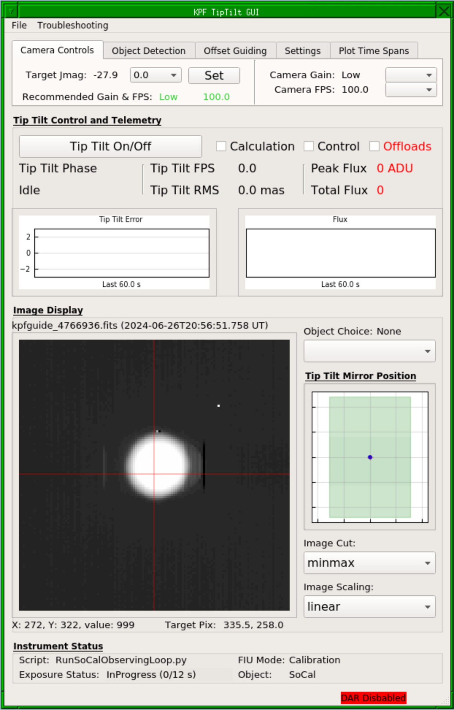
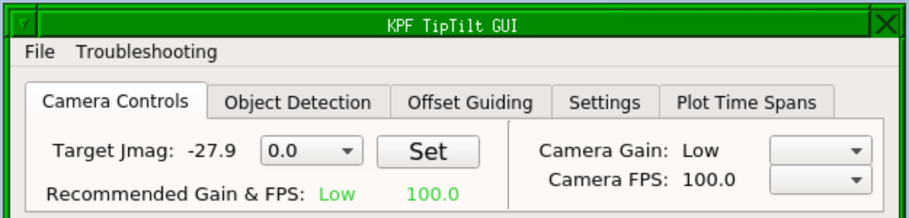
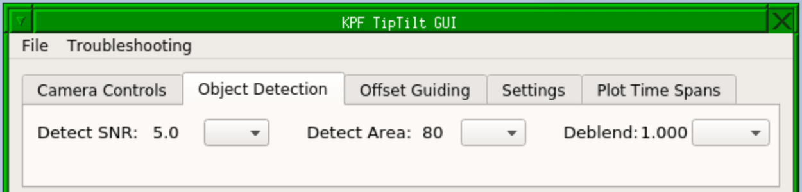
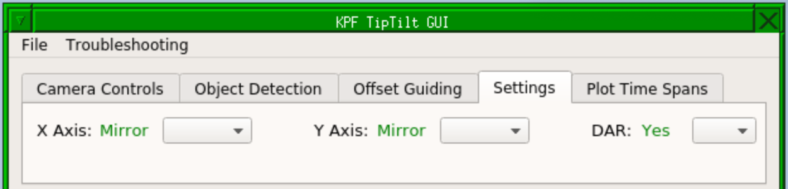
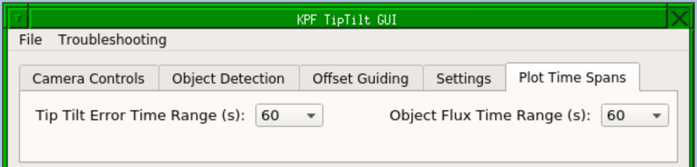

# Tip Tilt Instructions for OAs

## TL:DR Procedure

1. Set the gain and FPS values for the guide camera.
1. Acquire the star to the KPF PO using magiq.
1. In the KPF Tip Tilt GUI, turn on the tip tilt loops.
1. Verify normal operation of the loops (this should just require a momentary glance at the various indicators):
    - Make sure the science target has been indentified.  It should have a circle around it and a label in the image display part of the GUI.
    - Check that an object has been selected in "Object Choice".
    - Check that the Peak Flux is sufficient (the value will be color coded to help you). If needed, adjust the gain and FPS.
    - Check that the Tip Tilt Error is decreasing over time in the plot. This indicates that the star is being moved to the target pixel.
    - Check the "Tip Tilt RMS" value is around 50 mas or better. If the target is faint or there are heavy clouds or bad seeing, it may not be able to reach this, but under normal conditions we should at least be in the ballpark.
    - If there are multiple stars in the field of view, ensure that the corect target is selected and that the stars are not blended.  Each detected star will have its own OBJECTn label in the image display: **make sure this is centered on the star**.
1. Inform the observer that the tip tilt loops are engaged and they can begin exposing.

### Troubleshooting the TL:DR Procedure

- If the system is not seeing the target star, adjust the "Detect SNR" and/or "Detect Area" values under the Object Detection tab in the GUI (see [Star Detection Algorithm](#star-detection-algorithm) section below for details).
- If the system seems to be having trouble identifying stars, toggle the loops on and off (this is primarily for the Calculation loop). Doing this will cause the algorithm to re-identify the stars and may resolve ID confusion caused when stars are moving rapidly in the field.
- Check that there are no red indicators in the status bar at the bottom of the Tip Tilt GUI.  These indicate that something substantial is wrong.  Which indicator it is will tell you which keyword or dispatcher is in a bad state.

## Tip Tilt System Overview

The KPF tip tilt system takes fast (e.g. 100 FPS) subframe images from the KPF CRED2 guide camera in order to control the fast tip tilt mirror which directs light in to the KPF FIU.  This fast tip tilt system maintains the stellar position on the science fiber.  This is critical not for reasons of maximizing flux in to the spectrograph (though that is a side benefit), but to optimize the radial velocity measurement.

Even after fiber scrambling and agitation, if the star’s position on the fiber entrance fiber shifts, that can manifest as a small shift of the spectrum on the detector which would be interpreted as a radial velocity change.  Thus we need to position the star on the fiber, and then hold it in a consistent place during observations and make that position consistent from observation to observation.

## Tip Tilt GUI

To start the GUI, open a terminal as any kpf user (e.g. kpfeng) on the kpf machine and type: `TTGUI_v2`.  For dark mode, add the `-d` option to the command.

>  A screenshot of the Tip Tilt GUI.

The Tip Tilt GUI may also be opened for observers in "monitor" mode, in which case none of the controls are active, but the telemetry and image display can be seen.  To do this, use the `TTGUI_v2 --monitor` terminal command as above or select `KPF Control Menu -> Subcomponents -> Start Tip Tilt GUI` from the FVWM menu in a KPF VNC session.

### GUI Layout

The top section of the GUI (beneath the "File" and "Troubleshooting" menus), is a small tabbed interface with various controls and options. See the sections below on each tab.

Beneath the tabbed section is a region titled "Tip Tilt Control and Telemetry" this section contains control for the tip tilt loops and telemetry about the tip tilt performance.  See the [Tip Tilt Control and Telemetry](#tip-tilt-control-and-telemetry) section below for details.

Beneath that is a region titled "Image Display" which shows the latest Magiq image cropped to the region which the tip tilt system is using (a subframe of the whole field).  It also contains the tool for choosing which object in the field to guide on and controls for the image display stretch and cut.  See the [Image Display](#image-display) section below for details.

Beneath that is a region titled "Instrument Status" which contains a very brief summary of what the instrument is doing at the moment. See the [Instrument Status](#instrument-status) section below for details.

The very bottom of the GUI is the status bar which will be empty if everything is in a working state for observing.  See the [Status Bar](#status-bar) section below for details.

#### Camera Controls Tab

>  A screenshot of the Tip Tilt GUI's Camera Controls tab.

When the observer executes an OB (which they should do during the slew, but they may forget or not be ready, so check if you are unsure), then the target star's J band magnitude will be populated in this GUI.  This will also update the "Recommended Gain & FPS" values.  If you wish to accept these recommendations, simply click the "Set" button.  The recommendations will be color coded green if they match the current values or orange if they do not match.

The pulldown to the left of the "Set" button will add in some amount of extinction (in magnitudes) to the estimated values.  If you have clouds, you can put in some value for the extinction and the estimate will account for the clouds.

The right hand section of the tab shows the current Gain & FPS values.  You may set them here using the pulldown menus.

You can set these values on the command line by modifying the relevant keywords: `kpgduide.GAIN`, and `kpfguide.FPS`.

#### Object Detection Tab

>  A screenshot of the Tip Tilt GUI's Object Detection tab.

This is where you can set the object detection and deblending parameters discussed in the [Star Detection Algorithm](#star-detection-algorithm) section below.  The pulldowns will set the requested value.

You can set these values on the command line by modifying the relevant keywords: `kpgduide.OBJECT_INTENSITY`, `kpfguide.OBJECT_AREA`, and `kpfguide.OBJECT_DBCONT`.

#### Offset Guiding Tab

Not currently implemented.

#### Settings Tab

>  A screenshot of the Tip Tilt GUI's Settings tab.

The three options here control various settings for the `kpfguide` algorithms.

The "X Axis" and "Y Axis" settings allow you to bypass the tip tilt mirror and control the star position only using offloads to the telescope (conceptually similar to normal Magiq guiding). These values should be "Mirror" unless there is a problem with the tip tilt system.

The "DAR" setting determines whether the target pixel for the star is modified to account for differential atmospheric refraction (DAR) between the guide wavelengths (950-1200nm) and the science wavelengths (centered on 550nm).  This should be set to "Yes" under normal observing conditions.

#### Plot Time Spans Tab

>  A screenshot of the Tip Tilt GUI's Plot Time Spans tab.

These two pulldowns allow you to change the time span of the two plots in the [Image Display](#image-display) region of the GUI.  They have no effect on the tip tilt performance, only the plots.

#### Tip Tilt Control and Telemetry

#### Image Display

#### Instrument Status

#### Status Bar

## Star Detection Algorithm

## Multiple Stars

