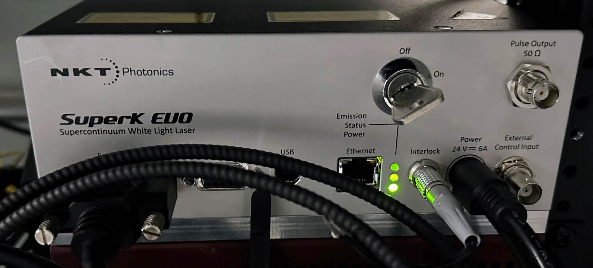
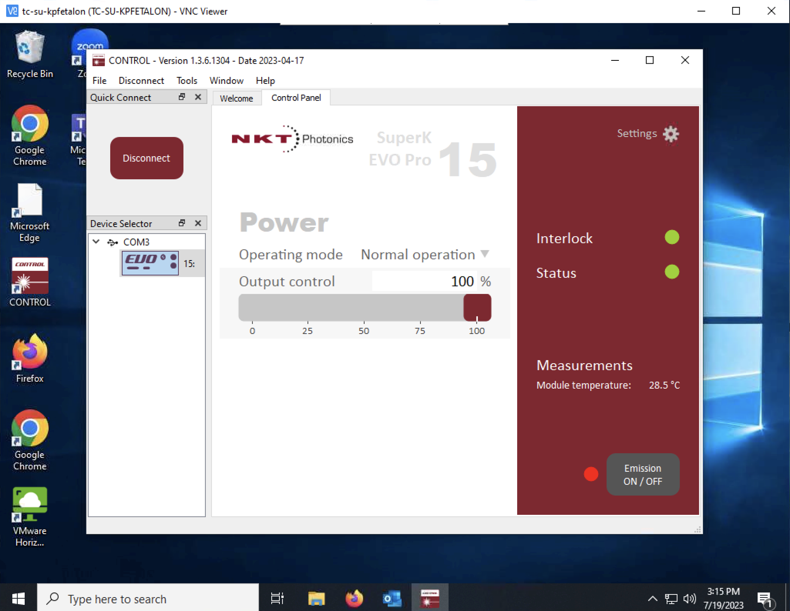
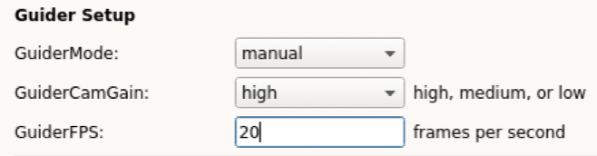
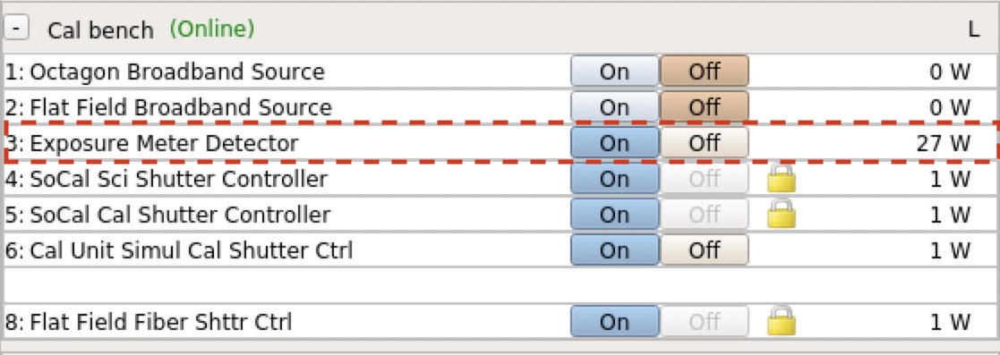
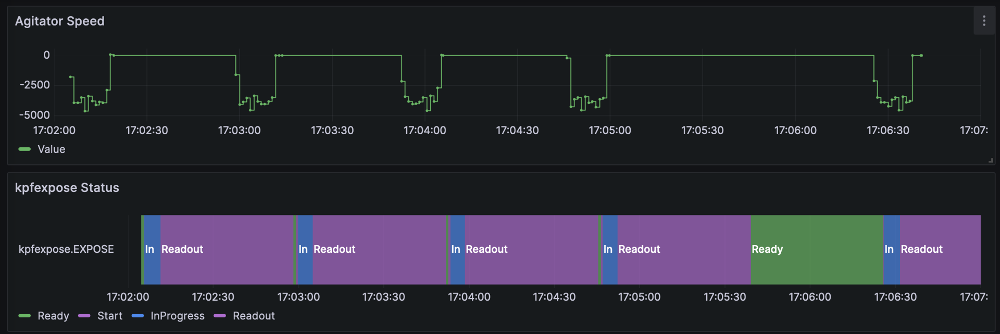
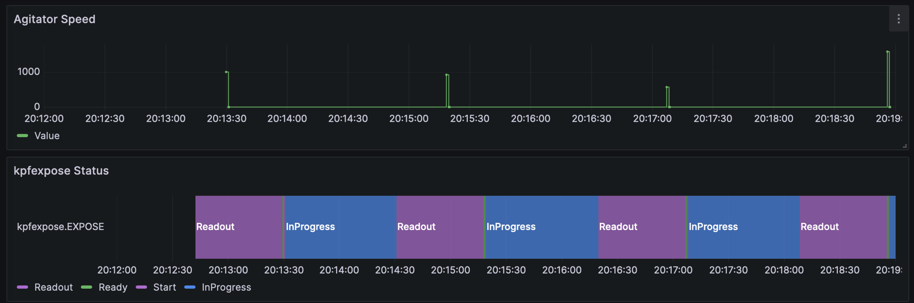
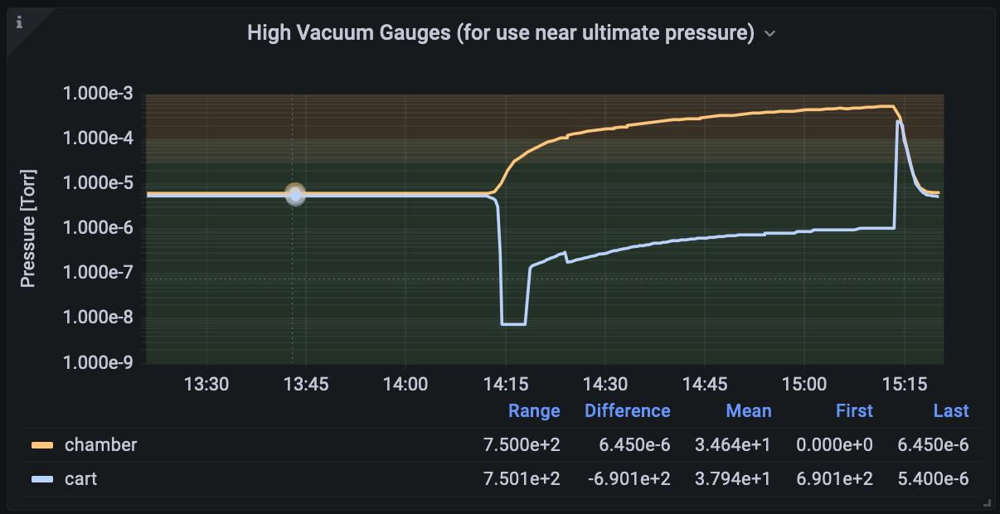

# Troubleshooting

### Table of Contents

* [General Principles](#general-principles)
* [Log File Locations](#log-file-locations)
* Scripts
    * [Existing Script is Running](#existing-script-is-running)
    * [Agitator Use is Disabled](#agitator-use-is-disabled)
* Calibrations
    * [Calibration Source is Not Working](#calibration-source-is-not-working)
    * [SlewCal or Simultaneous Calibration Source is Wrong](#slewcal-or-simultaneous-calibration-source-is-wrong)
    * [Etalon Light Source is Off](#etalon-light-source-is-off)
* Guider
    * [Target is not Visible in Guider](#target-is-not-visible-in-guider)
* FIU
    * [FIU Mode Change Fails](#fiu-mode-change-fails)
    * [Tip Tilt Performance is Poor](#tip-tilt-performance-is-poor)
* Detectors
    * [kpfexpose.EXPOSE is not Ready](#kpfexposeexpose-is-not-ready)
    * [Detector Refuses to be Triggered](#detector-refuses-to-be-triggered)
    * [Detector Fails to Trigger Without Error](#detector-fails-to-trigger-without-error)
    * [Green or Red CCDPOWER Fails to turn on](#green-or-red-ccdpower-fails-to-turn-on)
    * [Ca HK Detector Stuck](#ca-hk-detector-stuck)
    * [Exposure Meter in Error State](#exposure-meter-in-error-state)
* L0 File Generation
    * [Deprecated L0 files](#deprecated-l0-files)
* Agitator
    * [Agitator Sounds Wrong or Speed is Wrong](#agitator-sounds-wrong-or-speed-is-wrong)
* Vacuum
    * [Vacuum Chamber Vacuum Levels Rising](#vacuum-chamber-vacuum-levels-rising)
* SoCal
    * [Enclosure Lid Does not Move 1](#enclosure-lid-does-not-move-1)
    * [Enclosure Lid Does not Move 2](#enclosure-lid-does-not-move-2)


# General Principles

DO NOT use `control-c` to stop a script, this can leave the instrument in an unsafe state.  Use `kpfconfig.SCRIPTSTOP` to request a stop (also available as a button in the KPF OB GUI).

# Log File Locations

Relevant log files for KPF are located in the following locations:

* Services and dispatchers write their logs to the `/usr/local/kroot/var/log` directory **on the server on which they run**.  Most services run on kpfserver, but FIU related services run on kpffiuserver for example. A shortcut to that directory is available on the command line: `cdlog`
* The KPF Translator writes logs to the data disk: `/s/sdata1701/KPFTranslator_logs`
    * A shortcut to that directory is available on the command line: `cdtlog`
    * Within that directory, all KPF translator log lines are written to: `KPFTranslator.log`
    * Also within that directory are date directories such as `2023jul01` which contain logs which are written by high level scripts such as `RunOB`. The log lines in these files are duplicates of what is in the KPFTranslator.log file in the directory above, but are duplicated here for easier searching and examination.  It is also an easy way to see what high level scripts were run on a particular night.
* The command line interface for all of the translators writes to the date directories in `/s/sdata1701/KPFTranslator_logs` in a `cli_logs` subdirectory of the date.  For example: `/s/sdata1701/KPFTranslator_logs/2023jul01/cli_logs/cli_interface.log`
* The KPF OB GUI writes logs to the data disk in `/s/sdata1701/KPFTranslator_logs/OB_GUI.log`


# Scripts

## Existing Script is Running

<u>Symptom</u>:

A script fails on the command line with a message similar to:

```
kpf.FailedPreCondition: Failed PreCondition: Existing script RunCalOB.py (3303940) is running.
If the offending script is not running (PID not listed in ps)
then the script keywords can be cleared by running:
  reset_script_keywords
or invoking it from the FVWM background menu:
  KPF Trouble Recovery --> Reset script keywords
```

This may sometimes be seen at night if a scheduled calibration happens to be running when the science observer is trying to control the instrument (e.g. running the start of night script or running an observation).  Observing takes precedence over calibrations, so if this is the case, the calibration can be stopped as described below.

<u>Problem</u>:

The keywords used to track whether a script is running indicate that another script is currently using the system.

<u>Solution 1</u>: Another script is running and needs to be stopped

If another script is running and you need to terminate it in order to start something else, you should use the kpfconfig.SCRIPTSTOP keyword.  You can do this by setting the SCRIPTSTOP keyword to “Yes” either on the command line:

`modify -s kpfconfig SCRIPTSTOP=Yes`

or via the KPF OB GUI’s STOP button which performs the same action.

Setting SCRIPTSTOP to “Yes”  will **request** that the running script terminate in an orderly fashion. This may take several minutes depending on when the running script reaches a sensible breakpoint.  **It is important to use SCRIPTSTOP to halt a script (instead of hitting ctrl-c)** because cleanup actions will be performed after a SCRIPTSTOP (e.g. turning off laps to preserve their lifetime).

One of the things which can delay the running script terminating is a long exposure in progress.  You can halt an exposure in progress by requesting kpfexpose to end the current exposure:

`modify -s kpfexpose EXPOSE=End`

Once the exposure is complete and has read out, most scripts will then check SCRIPTSTOP and begin the termination and cleanup steps.

<u>Solution 2</u>: No other scripts are running

Sometimes the script keywords will be set as if a script is running, but the script has crashed and is not actually running.  In this case, other scripts will be blocked until the script keywords are cleared.  This can be done from the FWWM background menu using the `KPF Trouble Recovery --> Reset script keywords` entry or from the command line by invoking `reset_script_keywords`.

## Agitator Use is Disabled

<u>Symptom</u>:

When executing the start of night script, the log shows a warning such as:
`2023-05-06 00:22:27,449  WARNING: Agitator use is disabled for tonight`

<u>Problem</u>:

This means that the `kpfconfig.USEAGITATOR` keyword is set to “No”.  This keyword is meant to indicate the mechanism’s health.  A WMKO staff member will set this keyword to No if the agitator mechanism is not functional for some reason.

<u>Solution</u>:

The agitator can be reenabled by simply setting the keyword to “Yes”.  **This should only be done by WMKO staff** and should only be done if the agitator is fully functional.  A broken or misbehaving agitator mechanism presents a significant danger to the science fibers.


# Calibrations

## Calibration Source is Not Working

<u>Symptom</u>:

A calibration set is run, but does not take data for a lamp.

<u>Problem</u>:

The lamp may be disabled in kpfconfig. The log may contain a line similar to:
`2023-05-06 00:22:27,449  WARNING: Cal source EtalonFiber is disabled`

<u>Solution</u>:

The cal source has likely been disabled for a reason.  **Reenabling it should only be done by WMKO staff** with knowledge of why it was disabled in the first place.

## SlewCal or Simultaneous Calibration Source is Wrong

<u>Symptom</u>:

With the simultaneous calibration source (which is printed to the start of night log) or the slew cal source (visible in the OB GUI) are not the desired value.

<u>Problem</u>:

These two sources are set from the same place and are always kept to the same value using the kpfconfig.SIMULCALSOURCE keyword.

<u>Solution</u>:

**This value should only be changed by WMKO staff**. The choice of calibration source is influenced by our desire to maintain the lifetime of the various lamps and calibration sources and by the need for warmup times on certain sources.  This is not something the user should adjust, contact a WMKO Staff Astronomer if you feel it is set incorrectly.


## Etalon Light Source is Off

<u>Symptom</u>:

There is no light visible from the etalon in spectra. This can be confirmed visually looking at the fibers coming from the SuperK light source which feeds the etalon.  Under normal conditions, glow can be seen at some fiber interfaces.

<u>Problem</u>:

The Super-K light source is off or otherwise incapacitated.

<u>Solution</u>:

Note: A safety issue is that the super-K puts out considerable power, including in the infrared.  The optical output is connected to the etalon so this won’t be a problem.  But one shouldn’t disconnect that fiber and look into the beam.  It is exceptionally bright in the optical so this is probably obvious, but I mention it just in case.

Check that the SuperK is powered on at the PDU (port M7 available via the Power GUI, or `gshow -s kpfpower OUTLET_M7`).

If the system is powered on, check that the interlock lights are green as seen in the photo below.  The interlock is just two very thin wires that I twisted together.

Check that the key is in the On position (see photo below).



If these indicate that the status is ok, then the SuperK may need to be powered on from software.  There is currently no keyword based client for this and this must be done from a Windows machine running the NKT Control software. There is a small Windows machine (`tc-su-kpfetalon` or `10.104.10.157`) connected via USB which is accessible via VNC.  VNC in as user kpfeng.

Once connected via VNC, the Control software should be available on the desktop.  Start that and connect to the device.  Once connected, the system should look like the screenshot below when in an operational state.  The power on the light, use the “Emission ON/OFF” button.



# Guider

## Target is not Visible in Guider

<u>Symptom</u>:

The observer’s target is not visible on the guider after slewing there.  This could be due to one of several problems.  Often this is related to the small field of view (FoV) of the guider which is approximately 30x40 arc seconds.

<u>Problem 1</u>: Telescope pointing

The telescope pointing is off (Ca or Ce is wrong) or the star is a high proper motion star and is not at the expected coordinates.

<u>Solution 1</u>:

The OA should check a nearby, bright pointing star.  If it centers up nicely, this suggests that either the coordinates of the target are wrong (or simply not corrected for proper motions).  The star may be just off the edge of the field, so the OA can check by making a few small telescope moves to probe the area just off the edge of the field.

<u>Problem 2</u>: Guider sensitivity

The star is too faint for the current guider camera settings or the extinction from clouds has made the star too faint to detect.

<u>Solution 2</u>:

If it is not already, increase the guider camera’s gain setting to high and see if the star appears.  This can be accomplished either in the tip tilt GUI or via command line: `kpfSetGuiderGain high`.

If the target star is faint in J band magnitude (e.g. Jmag > 12) (Note that 2MASS is a good source to determine expected J magnitude), then the guider may need to have the frames per second (FPS) value lowered to increase sensitivity.  If conditions are good (i.e. little or no extinction from clouds), then there is a tool which can set reasonable guesses for the guider gain and FPS based on the J magnitude of the star.  For example: `kpfPredictGuiderParameters 13.2` (for Jmag=13.2) will set both guider gain and FPS.

If there is substantial extinction from clouds, the user may need to manually configure the guider parameters.  This is best done by editing the observing block.  In the KPF OB GUI, this can be accomplished by setting the GuiderMode to manual, and setting the gain and FPS below (see screenshot).



Alternatively the observer may set these manually using the command line tools `kpfSetGuiderGain` and `kpfSetGuiderFPS`, but if an OB is executed it will overwrite the previous values, so to use the new values for science, they must be copied to the OB prior to execution.

<u>Problem 3</u>: Light is not reaching the guide camera

The light is not reaching the guide camera due to an obstruction.

<u>Solution 3</u>:

Look at the FIU GUI to see if there is an obstruction.  Possible culprits include:
* The AO hatch is closed: check keywords or FIU GUI. The hatch can be opened using the command line `kpfControlAOHatch open` or from the FVWM menu: `KPF Utilities -> Open AO Hatch`
* The FIU hatch is closed: check keywords or FIU GUI. The hatch can be opened using the command line `kpfControlHatch` open or from the FVWM menu: `KPF Utilities -> Open FIU Hatch`
* The FIU is in the wrong mode: check keywords or FIU GUI. The FIU may be in calibration mode or in an unknown state, either of which can result in the calibration fold mirror blocking the light. The mode can be set using the command line `kpfConfigureFIU Observing` or from the FVWM menu: `KPF Utilities -> Set FIU Mode to Observing`


# FIU

## FIU Mode Change Fails

<u>Symptom</u>:

The FIU failed to reach destination mode (`kpffiu.MODE`) after repeated attempts. One possible error code which you might see is:

`decode_write_response_event(): MODE (on behalf of MODE): ERR_WRITE_SW_ERROR (-5401) There was an error in the device-specific write routine for this keyword:  check the log files
`

<u>Problem</u>:

One possible reason for this is that the fold mirror is in a limit switch.  To establish if this is the case:

```
gshow -s kpffiu FOLDLIM
     FOLDLIM = Positive
```

<u>Solution</u>:

Reset and home the fold mirror stage

```
modify -s kpffiu FOLDCAL=Reset
modify -s kpffiu FOLDCAL=Homed
```

Then either set `FOLDNAM` to the destination or set `MODE` to the desired destination.

## Tip Tilt Performance is Poor

<u>Symptom</u>:

Tip tilt performance is poor.  The star is moving a lot on the guider, perhaps primarily in either the X or Y pixel direction.

<u>Problem</u>:

One possibility is that the XY stage is failing.  The symptom is that the stage has lost range and can not reach the commanded position.  To determine if this is the case, stop observing and stop the tip tilt loops and:

* Watch the kpffiu `TTXVAX` and `TTYVAX` keywords (e.g. via an xshow).
* Command one of the axis to someplace near the nominal limit and watch to see if the keyword value reached the location it was commanded to go.  The X stage should be able to go from -15 to +15 and the Y stage should be able to go -20 to +20 (they actually can access a bit more, but this is a reasonable amount to test). For example:
    * `modify -s kpffiu TTXVAX=-15` (note where the keyword actually goes)
    * `modify -s kpffiu TTXVAX=15` (note where the keyword actually goes)
    * `modify -s kpffiu TTYVAX=-20` (note where the keyword actually goes)
    * `modify -s kpffiu TTYVAX=20` (note where the keyword actually goes)
* If one or more of the above tests falls far short of the destination, then we need to tell the software not to use that part of the range. 

It is worth repeating the test above to see if you get consistent results.  If the results are not consistent, then the procedure below will be of limited utility.

<u>Solution</u>:

There are several components to this fix and it is important to understand what each does, so that you can perform the fix properly. The section below explains how the keywords are used, then we will discuss how to set them.

<u>Understanding Tip Tilt Keywords</u>

* The `kpffiu` service handles commands to the tip tilt stage.
    * `TTXVAX` and `TTYVAX` report the position of the stage in arc seconds of tilt.  This is tilt of the stage, not movement of the star on the focal plane.
    * `TTXRAW` and `TTYRAW` are the position of the stage in raw encoder counts.
    * `TTXRON` and `TTYRON` define the home position of the stage for the stage controller in raw encoder counts.
* The `kpfguide` service handles the control loop used to decide where to command the stage to go.
    * `TIPTILT_HOME` defines the (x, y) coordinates of the home position in arc seconds of motion of the stage. This is where the stage will be positioned if no tip tilt moves are needed – it is the center of the stage motion.
    * `TIPTILT_XRANGE` and `TIPTILT_YRANGE` define the maximum range of motion which the guide system should use during observing (in units of arc seconds of stage motion). This is the half width of the range, so the stage can go from the home position - range to home position + range.

The combination of `kpfguide.TIPTILT_HOME` and `kpffiu.TT{x,y}RON` define the center of motion of the stage and we want those to be in agreement.  Unfortunately, these are in different units, so we need to keep that in mind and ensure they are consistent when we set new values. Once the center position is defined, the system uses `kpfguide.TIPTILT_{x,y}RANGE` to decide how far to push the tip tilt mirror before offloading to the telescope.


<u>Setting Up the Tip Tilt Center Position and Limits</u>

Above we discovered the limits (in `TT{x,y}VAX` units) where the stage seems to be able to go.  Use those values to determine the home position (center point between the limits) and the range (distance from home to one limit).  Use those calculated values to set `kpfguide.TIPTILT_HOME` and `kpfguide.TIPTILT_{x,y}RANGE`.

Now move the stage to the home position by setting `kpffiu.TT{x,y}VAX` and read off the `kpffiu.TT{x,y}RAW` value.  Update the `kpffiu.TT{x,y}RON` strings with that value, maintaining the proper formatting: `|{raw value}|0|Home.`

There is an experimental script to do the above steps, but you must manually verify that the results look reasonble. Run `kpfMeasureTipTiltMirrorRange` and it will print out a set of modify commands for you to run (it does not execute them itself).  Check the logic and math, the script is experimental! Note that if the script finds a limit which is unexpected (i.e. less range than nominal), it will set up the above keywords to a range 1 arc second smaller than where the limit is.  It adds this safety margin to the `kpfguide.TIPTILT_{x,y}RANGE` keywords, so if you calculate something slightly different than the script, this may be why.

# Detectors

## kpfexpose.EXPOSE is not Ready

<u>Symptom</u>:

The `kpfexpose.EXPOSE` keyword is reporting an unexpected state such as reporting "InProgress" even though the exposure should have finished or is reporting "Error".

If `kpfexpose.EXPOSE` is not ready, it will not allow users to take new exposures which is how this will likely manifest.

<u>Problem</u>:

One of the detectors may not be in a normal state.

Use the `EXPLAINNR` keyword to determine which detector is blocking `kpfexpose.EXPOSE` from becoming "Ready". For example, if `kpfexpose.EXPLAINNR` is reporting "hk:ACQPHASE=wait", that indicates that the CaHK detector is not in the Ready phase. The detailed solution will depend on which camera and what is causing the blockage.

<u>Solution 1</u>: Reset the Red or Green detector

If either the Red or Green camera is the problem as reported by `kpfexpose.EXPLAINNR` or by the relevant camera's `EXPSTATE` keyword, the setting the particular camera's `EXPOSE` keyword to "Reset" may resolve things (e.g. `modify -s kpfgreen EXPOSE=Reset`).

<u>Solution 2</u>: Abort Ca HK Exposure

If the Ca HK detector appears to be the problem (e.g. `kpfexpose.EXPLAINNR` value is "hk:ACQPHASE=wait"), then aborting the exposure in progress may free up the Ca HK detector. To do so run: `modify -s kpf_hk EXPOSE=abort`

<u>Solution 3</u>: Restart the relevant keyword service or dispatchers

If the above has not helped, restarting the service may free things up. Possible services to restart include `kpfexpose`, `kpfgreen`, `kpfred`, `kpf_hk`. It is suggested that you only restart the service if there is some indication that it is the source of the problem (either from `kpfexpose.EXPLAINNR` or from the service's `EXPSTATE` for example).

## Detector Refuses to be Triggered

<u>Symptom</u>:

When running an OB, or invoking command line scripts, a particular detector is not set to be triggered even though it is requested.

<u>Problem</u>:

The detector may be disabled in `kpfconfig`. The log may contain a line similar to:

`2023-05-06 00:22:27,449  WARNING: Green detector is not enabled`

<u>Solution</u>:

The detector has likely been disabled for a reason.  **Reenabling it should only be done by WMKO staff with knowledge of why it was disabled in the first place.**

## Detector Fails to Trigger Without Error

<u>Symptom</u>:

The detector is not exposing and not producing output files, but `kpfexpose` is unaware of the problem and takes exposures as normal triggering all selected cameras.

<u>Problem</u>:

Something is stuck in the dispatcher code for driving the Archon (this only applies to red and green detectors).

<u>Solution</u>:

Restart dispatcher 0 on the affected detector: `kpf restart kpfgreen0`

## Green or Red CCDPOWER Fails to turn on

<u>Symptom</u>:

When trying to power up the detector by setting the CCDPOWER keyword to “On”, the keyword does not successfully transition to on.  The stderr file for the relevant camerad process (e.g. `gcamerad.stderr`) contains statements like:

`(Archon::Interface::archon_cmd) ERROR: Archon controller returned error processing command: POWERON`

<u>Problem</u>:

There is something wrong in the ACF file for the Archon.

<u>Solution</u>:

Resend the ACF file by either modifying the appropriate ACF keyword or using the `kpfSetReadModeNormal` or `kpfSetReadModeFast` scripts.

## Ca HK Detector Stuck

<u>Symptom</u>:

The HK detector is stuck in the exposing state.

or

The `kpfexpose.EXPOSE` status is stuck and `kpfexpose.EXPLAINNR` is "hk:ACQPHASE=wait".

<u>Problem</u>:

Some combination of hardware and software is stuck.

<u>Solution</u>:

1. Abort the existing HK exposure: `modify -s kpf_hk expose=abort` (alternatively, the same action is available via the FWWM menu under `KPF Troubleshooting Menu -> KPF Trouble Recovery → Reset Ca HK Detector`).
1. Then restart the kpf_hk service: `kpf restart kpf_hk`
1. Take test exposures to see if the system has recovered.
1. If the system is still stuck, power cycle the Andor Camera, and the HK Galil on power strip J, ports 1, 2, and 5, then restart kpf_hk again.  This can be accomplished in one step using: `kpfPowerCycleCaHK` (alternatively the same tool is available via the FWWM menu under `KPF Troubleshooting Menu -> KPF Trouble Recovery -> Power Cycle Ca HK Detector`).
1. If the detector is still not responsive, check the log files on `kpffiuserver`. If the `kpf_hk.stderr` file contains lines like this after a restart of the kpf_hk service: 
```
open() failed: No such file or directory
Failed to configure camera: init failure, using path="/usr/local/etc/andor": DRV_VXDNOTINSTALLED
```
Then it means that the USB connection is unhappy for some reason.  The recovery is to ask for a reboot of `kpffiuserver`. This will require restarting the `kpffiu` service as well.

## Exposure Meter in Error State

<u>Symptom</u>:

The exposure meter is in an error state: `kpf_expmeter.EXPSTATE=Error`

<u>Problem</u>:

Something in the SBIG CCD control software is unhappy.

<u>Solution 1</u>:

First, try resetting the exposure meter detector:

`modify -s kpf_expmeter EXPOSE=Reset`

Check the status: `gshow -s kpf_expmeter EXPSTATE` should become “Ready”.

<u>Solution 2</u>:

If the above solution fails to recover the system, power cycle the camera on power port L3.



Then do `kpf restart kpf_expmeter`.  This is equivalent to `kpf restart kpf_expmeter1` (exposure meter camera) and `kpf restart kpf_expmeter2` (exposure meter DRP).

Sometimes `kpf_expmeter2` is stuck in a busy state after a `kpf_expmeter1` restart. Both `kpf_expmeter1` and `kpf_expmeter2` need to be ready before kpfexpose can trigger new exposures.

You may need to set the `TOP`, `LEFT`, `WIDTH`, and `HEIGHT` keywords after restarting the software.  The values are:

```
[kpfeng@kpfserver] ~ > gshow -s kpf_expmeter LEFT TOP WIDTH HEIGHT
        LEFT =  1
         TOP =  0
       WIDTH =  651
      HEIGHT =  300
```

The correct values are checked in `testAll`, so you can always run that to verify values are ok.

# L0 File Generation

## Deprecated L0 files

L0 files are generated by gathering the “sub-FITS” files from the Green, Red, CaHK, EM, and guide cameras, processing some of them (EM and guide camera), adding telemetry drawn from KTL keywords and the sub-FITS headers to the new L0 FITS header, and writing the L0 file.  This process happens automatically by using keywords to notify a dispatcher that a recent exposure is ready for L0 file creation.  If this dispatcher is stopped or dies, it can be restarted with the command `kpf restart assemble`.  If L0 files need to be generated manually (e.g., because the dispatcher stopped or L0 files need to be regenerated), it can be done with the command 

`l0_assemble --outdir path NNNNN MMMMM`

where `path` is the directory where the L0 files should be written (e.g., `/sdata1701/kpfeng/DATE/L0`), `NNNNN` is the first `FRAMENO` (a header keyword for Green and Red FITS images and an index which is incremented with each exposure; e.g. `33015`), and `MMMMM` is the last `FRAMENO` in a range of files (e.g., `33020`).  The final argument is optional if only one L0 file needs to be generated. 

L0 files may be deprecated when switching to fast-readout mode. The observers may find broken L1/L2 files, and the L0 files are missing green/red/CaHK components. If L0 files needed to be regenerated, it is better to write to a new directory (e.g., `/sdata1701/kpfeng/DATE/new_L0`), and inform Jeff Mader so he can ingest the new L0 files to Keck Observatory Archive. 

# Agitator

## Agitator Sounds Wrong or Speed is Wrong

<u>Symptom</u>:

The agitator is not working as expected.  This is usually seen in the agitator speed value (see screenshots) or by listening to the sounds.  This is a plot of what the kpfmot.AGITSPD keyword value looks like as the agitator is cycled on during exposures.  It goes to a negative value of a few thousand during operation.



This is an example of a bad agitator speed behavior.  It goes positive for one data point, then back to zero.



You can listen to the agitator mechanism via the “KPF crypt M5075” camera on the [facility camera list](https://www.keck.hawaii.edu/twiki/bin/view/Operations/FacilityCameras) (note this is an internal web page at Keck).  In normal operation the agitator makes a regular (roughly 1-2 Hz) mechanical oscillation sound.  When the bad behavior above occurred it was either silent (note there is background fan noise on that camera) or would make a single mechanical “cachunk” sound, then stop.

<u>Problem</u>:

The motor is not initialized properly.

<u>Solution</u>:

Initialize using:

`modify -s kpfmot agitmod=pos`

`modify -s kpfmot agitini=no`

This leaves the system in Halt mode.  Initialize using:

`modify -s kpfmot agitmod=pos`

`modify -s kpfmot agitini=yes`

Note: if the ini command fails with: `Error setting agitini: agitini: ERR_STST_COND_TIMEOUT (-5239) StdStage condition did not become true within the time limit` try restarting the dispatcher (kpf restart kpfmot) in order to get it to release the thread lock on communications and they to initialize again.

# Vacuum

## Vacuum Chamber Vacuum Levels Rising

<u>Symptom</u>:

Vacuum levels in the chamber are rising, but the vacuum levels at the pump are falling.  These are `kpfvac.VCH_HIVAC` and `kpfvac.VCART_HIVAC` keywords respectively.

This might manifest as a “vac chamber trouble” alert from kpfmon.

<u>Problem</u>:

The gate valve between the vacuum chamber and the pump has closed.

The gate valve is currently (late 2023) not instrumented and is controlled by compressed air from the facility.  As long as facility compressed air is working, the valve is open and the pump should be keeping the vacuum chamber at good vacuum levels.  If the gate valve closes, it is presumably because compressed air has failed.

Below is a Grafana plot showing that as chamber pressure was rising, vac cart pressure was falling.  This is the signature of the gate valve being closed. In this example, the gate valve closed at about 14:12 local time and was opened again around 15:15 local time.




<u>Solution</u>:

# SoCal

## Enclosure Lid Does not Move 1

<u>Symptom</u>:

Enclosure will not move.  It may begin moving, then stop and reverse.

<u>Problem</u>:

Enclosure motor is hitting an overcurrent limit.

To verify this is the problem, log in to the dome controller from kpfeng@kpfserver:

`ssh socal`

This connects to the Raspberry Pi controller in the dome enclosure.  The username and IP address has configured in the `~/.ssh/config` file on kpfserver (you can ssh manually using `pi@192.168.23.244`) and the SSH key for kpfserver has been installed on the Pi, so it should not ask for a password, but if it does, the password in in the usual `showpasswords` location.

View the dome log file in the `~/dome.log` and look for errors which indicate the nature of the problem.

The `~/grep_for_dome_error` script will exclude many of the noisy, not useful lines in the dome.log file and help with examining the log.

<u>Solution</u>:

If the log file indicates overcurrent on the motors is the issue.  Ensure the mechanisms are clear of obstruction and reasonably well balanced (it doesn’t need to be perfect).


## Enclosure Lid Does not Move 2

<u>Symptom</u>:

Enclosure will not move.  It may begin moving, then stop and reverse.

<u>Problem</u>:

Enclosure motor is not getting current.

To verify this is the problem, log in to the dome controller from kpfeng@kpfserver:

`ssh socal`

This connects to the Raspberry Pi controller in the dome enclosure.  The username and IP address has configured in the `~/.ssh/config` file on kpfserver (you can ssh manually using `pi@192.168.23.244`) and the SSH key for kpfserver has been installed on the Pi, so it should not ask for a password, but if it does, the password in in the usual `showpasswords` location.

View the dome log file in the `~/dome.log` and look for errors similar to:

```
2024-07-09 19:09:37,752 WARNING  Operation timed out (35.0 secs), max measured motor
current: 0.0 A.
```

The `~/grep_for_dome_error` script will exclude many of the noisy, not useful lines in the dome.log file and help with examining the log.

<u>Solution</u>:

Reboot the controller (raspberry pi): `sudo reboot` and restart the kpfsocal3 dispatcher: `kpf restart kpfsocal3`.  Multiple reboots may be required.
